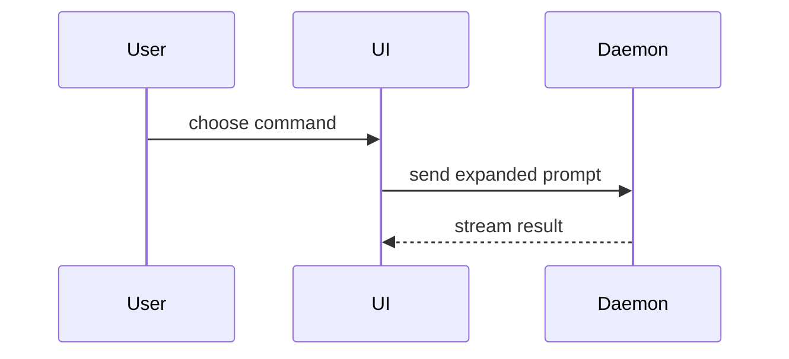

# Show me

## In the consuming repo

- Primary job here: make **PR bodies** (and review replies) show the
  slice shape — call tree, file tree, component tree, Mermaid sequence,
  or a structural `diff` of what changed — so a reviewer reading only
  the body can describe the same cut `git diff <base>...HEAD` shows.
- Wire through `/create-pr` §3 after drafting the template Summary /
  Test plan, before the final `/unslop` on title and body.
- Prefer **in-body markdown** GitHub renders (fenced `text` / `tsx` /
  `diff` / `mermaid`). Do **not** attach standalone HTML decks for PR
  bodies — GitHub will not render them; use `/pr-preview-media` for UI
  screenshots and MP4s instead.
- Keep the repo's glossary names (`CONTEXT.md` or equivalent) and any one-name
  list in `AGENTS.md`. Positive stack prose only.
- After visuals, run `/unslop` on the surrounding PR prose.

Help the reader understand the current topic visually. Skip the preamble
and keep prose brief. Pick the smallest view that makes the key point
clear.

- Show logic or an algorithm as pseudocode:

```text
on(save)
  if content is unchanged
    return cached result
  write new content
  return fresh result
```

- Show runtime control flow as a call tree:

```text
submitForm
  createSession
    persistPrompt
    launchAgent
  navigateToSession
```

- Show UI structure as a component tree, including state and module
  boundaries that matter:

```tsx
<SessionPage> (apps/example/src/routes/session.tsx)
  useSessionEvents()
  <SessionToolbar>
    <RunSkillButton> (packages/ui)
```

- Show file responsibility or a broad refactor as a shallow file tree:

```text
src/
├── commands/       # parses user actions
├── sessions/       # owns session state
└── transport/      # sends API requests
```

- Show component interaction, control flow, or data flow with Mermaid:



- Use `diff` when the point is what changes and the surrounding shape
  already exists. Match the diff shape to the topic.

For a component change:

```diff
 <SessionPage>
   useSessionEvents()
   <SessionToolbar>
+    <RunSkillButton />
   <SessionTimeline>
+    <SkillResultCard />
```

For a file-layout change:

```diff
 src/
 ├── commands/
+│   └── show-me.ts       # expands the slash command
 ├── sessions/
-└── transport.ts
+└── transport/
+    ├── client.ts
+    └── stream.ts
```

For a call-tree or call-stack change:

```diff
 submitForm
   createSession
     persistPrompt
+    expandSkillMention
     launchAgent
-  navigateToSession
+  navigateToSession
+    subscribeToEvents
```

For a state or control-flow change:

```diff
 on(save)
-  write content
+  if content is unchanged
+    return cached result
+  write new content
+  invalidate cache
```

- Show the whole block when most of it is new, when omitted context would
  hide ownership or order, or when the reader needs a copyable target
  shape:

```ts
function expandSkill(command: string): string {
  const skillName = command.slice(1)
  return `use the ${skillName} skill`
}
```

- For a visual UI proof in a PR, prefer `/pr-preview-media` (screenshot /
  MP4 in the Preview section). For a concept too dense for Mermaid
  **outside** a PR body (local chat / desktop), a single focused HTML
  file is fine — then open it on the laptop. Do not use that path for
  GitHub PR markdown.

### Guidance

Place each visual next to the short text it supports. Keep only the
calls, files, props, states, and boundaries needed for the current
question or PR slice.

You may use one of these, you may use several; it is unlikely you will
use all of them. Use judgement and do not overwhelm the reader.
