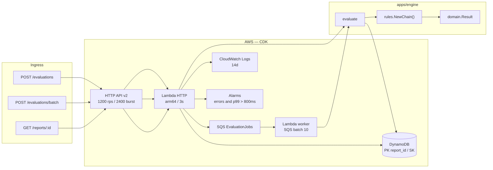
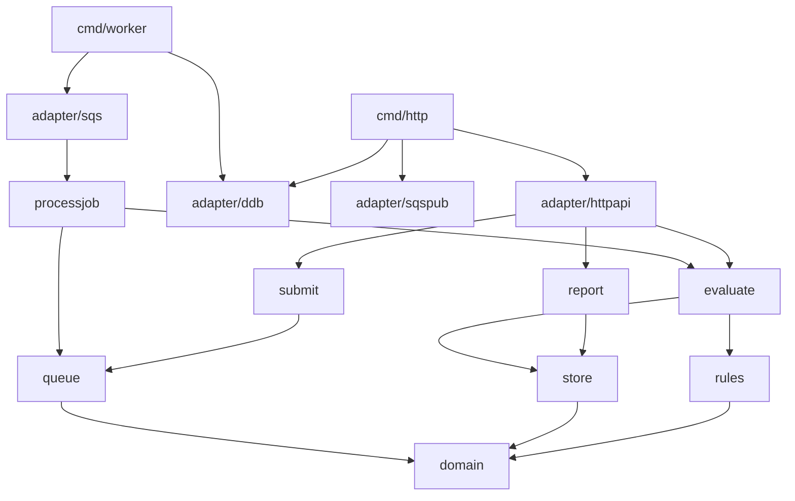
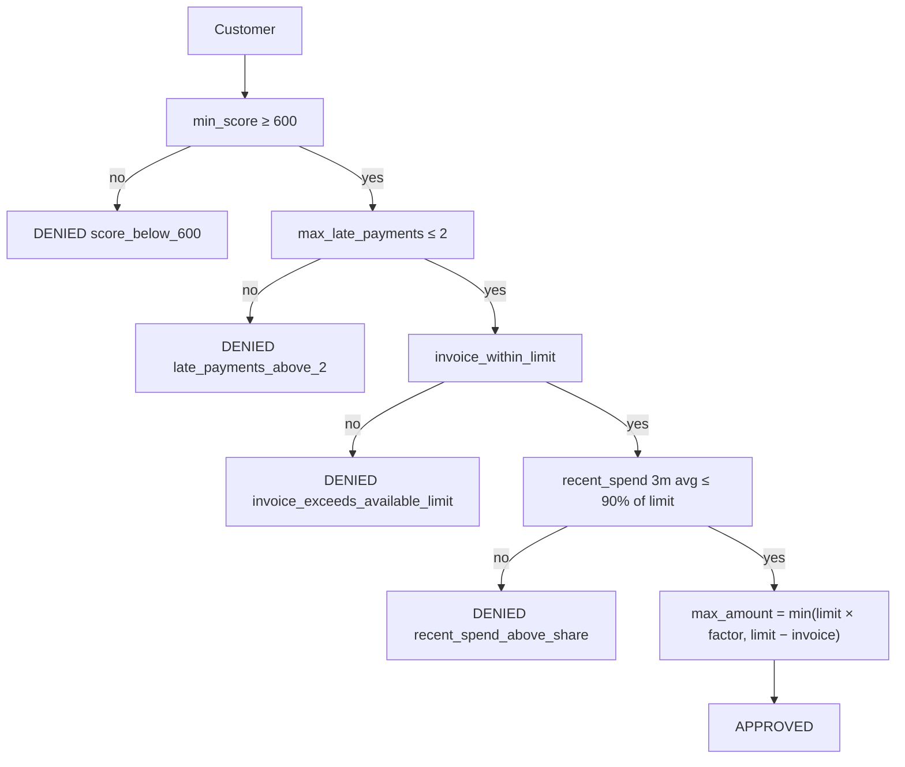

# Architecture

A revolving-credit evaluation simulation. There is no bureau, core banking
system, or frontend: the cut is the rules engine, the report, and the AWS
infra that backs the evaluation criteria.

IaC is **CDK in Go** (`packages/infra-iac/`). The product lives in
`apps/engine/`, split by use case. This file, `apps/engine/architecture_test.go`,
and the stack describe the cut.

## Cut

| Piece | Role |
|---|---|
| `internal/domain` | Customer profile and the verdict. No I/O. |
| `internal/rules` | Chain of Responsibility. `NewChain()` is the policy factory. |
| `internal/evaluate` | Use case: one customer → `Result`. Computes the amount if the chain passes. |
| `internal/submit` | Use case: list → `202` + one SQS job per customer, shared `report_id`. |
| `internal/processjob` | Use case: queue job → evaluate + persist on the report. |
| `internal/report` | Use case: `report_id` → snapshot (approved, denied, amount). |
| `internal/queue` / `internal/store` | Ports. Memory in tests; SQS and Dynamo in adapters. |
| `internal/adapter/httpapi` | HTTP API v2. |
| `internal/adapter/sqs` | Worker: consumes the queue. |
| `internal/adapter/sqspub` / `ddb` | Publishes jobs and writes decisions. |
| `cmd/http` `cmd/worker` | Composition root. |
| `packages/infra-iac` | CDK: HTTP API, two Lambdas, SQS, DynamoDB, logs, alarms. |
| `packages/loadtest` | k6 at **1000 req/s** on `POST /evaluations/batch` (10s = 10k jobs). |

## Runtime



Two paths, on purpose:

- **Sync** (`POST /evaluations`): one customer, 1s SLO, decide now.
- **Batch** (`POST /evaluations/batch` → SQS → worker → `GET /reports/:id`):
  HTTP only enqueues. This is the 1000 req/s loadtest path.

Dynamo runs **after** the verdict. If the table is down on the sync path, the
decision is already computed and persist returns 500 (the client retries). On
batch, HTTP already returned 202; SQS retries the worker.

## Packages

The same DAG that `architecture_test.go` locks. `domain` does not import AWS.
A new rule is a `Handler` plus one `SetNext` in the factory. Use cases and
adapters do not change.



## Decision

Chain of Responsibility: the first rule that denies stops the chain. The
amount is computed only if every rule passes.



Amount factor (higher score, larger share of the limit the product will
finance on revolving credit):

| Score | Factor |
|---|---|
| ≥ 800 | 80% |
| 700–799 | 50% |
| 600–699 | 30% |
| < 600 | never reaches here — `min_score` denies |

Money is integer cents. Reports and logs use a masked CPF (`***` + last 2
digits), never the raw CPF.

## Why these rules

Criteria are documented here. This is not a real bureau.

1. **Minimum score 600** — below that, revolving credit is already materialized
   credit risk. One cut, testable, no model.
2. **At most 2 late payments** — recent delinquency is the cheapest predictor
   of revolving default. Three or more means collections already started.
3. **Invoice ≤ available limit** — granting revolving on top of an over-limit
   invoice increases exposure with no collateral.
4. **Recent spend ≤ 90% of limit** — a customer already consuming the limit
   is revolving in practice. Average of the last 3 months, not a single month.

Change a cutoff = a field on the rule struct. Change the policy = a new file
plus one `SetNext` in `rules.NewChain()`.

## Evaluation criteria → design

| Criterion | How the design answers |
|---|---|
| **Latency ≤ 1s** | Sync engine, no I/O on the hot path. Lambda timeout 3s, 256 MB, arm64, **no VPC**. p99 alarmed at 800 ms. |
| **Accuracy** | Deterministic rules. Table tests in `rules` and `evaluate`. Stable reason code per rule. |
| **Scale 10k/min** | NFR floor. The cut demonstrates **1000 req/s** on batch: HTTP enqueues (202), worker processes batch 10, Dynamo on-demand. Stage at 1200 rps / 2400 burst. k6: 1000/s × 10s = 10k jobs. |
| **Extensibility** | `rules.Handler` + factory `NewChain()`. `architecture_test.go` keeps domain off AWS. |
| **LGPD** | CPF masked on `Result`. Encryption at rest managed. IAM only on the decisions table. No API auth in this cut (fictional data); production would be IAM on the HTTP API. |
| **Observability** | 14-day logs. Error and duration alarms. Dashboard for volume and p99. Reason codes in response JSON = deny rate per rule. |
| **Resilience** | The decision is pure. Persistence is after. On batch, SQS isolates HTTP from the worker: 202 already left; visibility + retry if Put fails. On-demand table. 5xx alarm on the sync path. |

## API

Wire types: `events.APIGatewayV2HTTPRequest` / `HTTPResponse`.

| Method | Path | Body | Response |
|---|---|---|---|
| `GET` | `/health` | — | `{"status":"ok"}` |
| `POST` | `/evaluations` | one `Customer` | `200` + `Result` (sync, 1s SLO) |
| `POST` | `/evaluations/batch` | `{customers:[...]}` or array | `202` + `{report_id, queued}` |
| `GET` | `/reports/{id}` | — | snapshot: approved, denied, `released_cents` |

## Infra (CDK Go)

`packages/infra-iac/` is the CDK app. `cdk.json` points at
`go run ./packages/infra-iac`. One stack, `us-east-1`.

| Resource | Choice | Why |
|---|---|---|
| HTTP API v2 | instead of REST API | less overhead; Floci covers it; no WAF/usage plan in this cut |
| Lambda `provided.al2023` arm64 | `GoFunction` | Go binary, cold start low enough for the SLO |
| Timeout 3s / 256 MB | — | SLO is 1s; 3s is a safety cap, not the budget |
| DynamoDB on-demand | instead of RDS | 1 Put per evaluation, PK `report_id`; no connection |
| AWS managed encryption | instead of CMK | a CMK does not change the case and costs more in the demo |
| No VPC | — | an ENI on cold start blows the 1s SLO for no reason; the table does not need a private network |
| No Cognito / authorizer | — | this cut is a simulation with fictional data |
| No SAM | — | one IaC, in the same language as the engine |
| Worker + SQS | 1000 req/s batch | HTTP only `SendMessageBatch`; the worker evaluates and persists |

```bash
make test
make local-bootstrap && make local-deploy
```

Evaluator: open the repo in the Dev Container (`.devcontainer/`). Steps and
curls: [`README.md`](../README.md).

## Rejected

| Alternative | Why not |
|---|---|
| SAM + CDK | Two IaC tools for the same stack. |
| RDS / Postgres | Latency and a connection pool for one Put per request. |
| `httpadapter` + `net/http` | Hides the HTTP API contract. The wire types are the AWS events. |
| Event sourcing / SNS / projectors | Closes none of the NFRs above. |
| Cognito + WAF + custom domain | Production theater. The cut is the engine and the rationale. |
