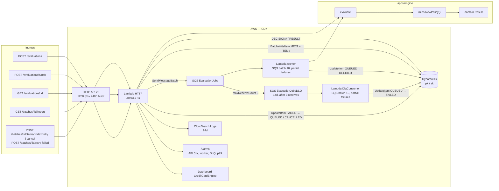
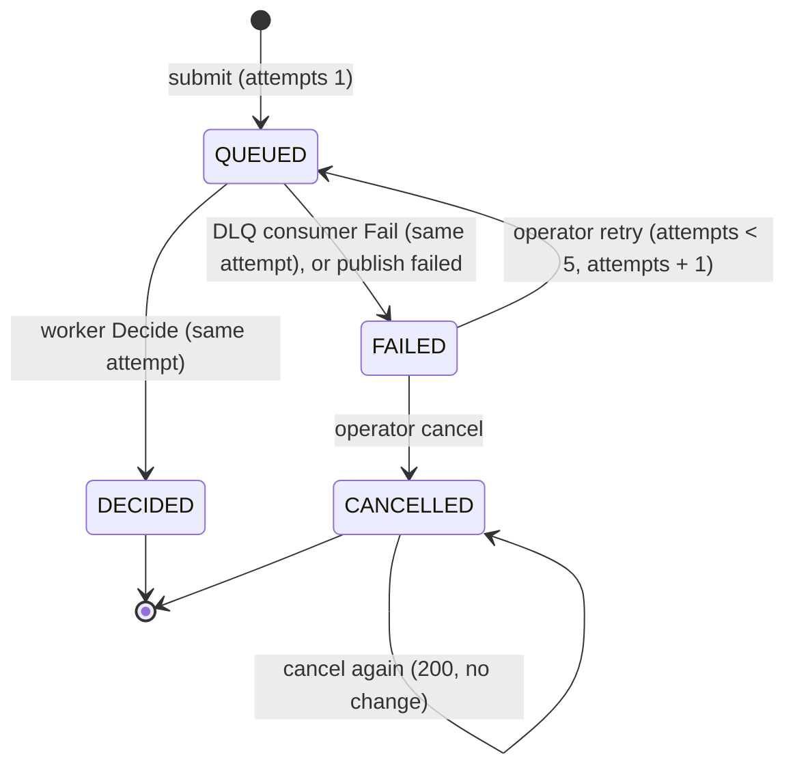
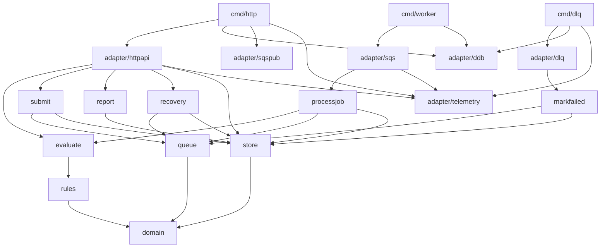
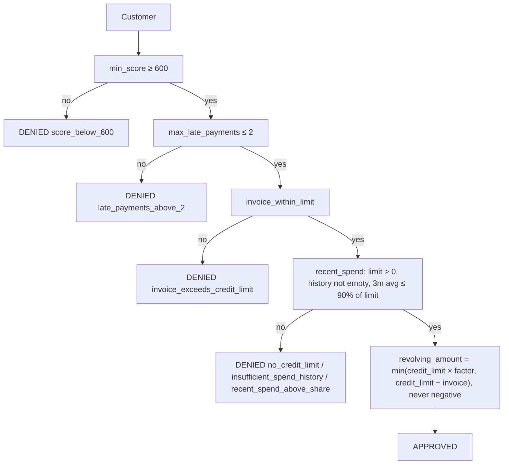

# Architecture

A revolving-credit evaluation simulation. There is no bureau, core banking
system, or frontend: the cut is the rules engine, the report, and the AWS
infra that backs the evaluation criteria.

IaC is **CDK in Go** (`packages/infra-iac/`). The product lives in
`apps/engine/`, split by use case. This file, `apps/engine/architecture_test.go`,
and the stack describe the cut.

## Cut

| Piece | Role |
|---|---|
| `internal/domain` | Customer profile, its validation, and the decision. No I/O. |
| `internal/rules` | Chain of Responsibility plus the `AmountPolicy` strategy. `NewPolicy()` is the policy factory. |
| `internal/evaluate` | Use case: one customer → `Result`. Applies the `rules.Policy`: the chain decides, the amount policy sizes an approval. Stores nothing; the caller records the decision. |
| `internal/submit` | Use case: at most `BATCH_SIZE` customers (default 100, max 1000) → a `batch_id`, every batch item stored `QUEUED`, then one SQS message per item. An item whose publish failed is marked `FAILED`. |
| `internal/processjob` | Use case: queue message → evaluate → `BatchStore.Decide`. A repeated delivery is a no-op. |
| `internal/markfailed` | Use case: DLQ message → `BatchStore.Fail`. |
| `internal/recovery` | Use case: operator retry, retry-failed, and cancel of failed items (ADR 0001). |
| `internal/report` | Use case: `batch_id` → `Report` (derived batch status, counters, approved, denied, failed, cancelled, total). |
| `internal/queue` / `internal/store` | Ports: `queue.Publisher`, `store.BatchStore` (`Create`, `Decide`, `Fail`, `Retry`, `RetryMany`, `Cancel`, `Item`, `Failed`, `Report`), `store.DecisionStore` (`Save`, `Get`). Memory in tests, with injected write and publish failures; SQS and DynamoDB in adapters. The store owns the item status transitions. |
| `internal/adapter/httpapi` | HTTP API v2. Validates customers before calling a use case. Stores a single evaluation through `DecisionStore`. |
| `internal/adapter/sqs` | Worker: consumes the queue and reports partial batch failures. |
| `internal/adapter/dlq` | DLQ consumer: consumes the DLQ and reports partial batch failures. |
| `internal/adapter/telemetry` | EMF logger: one JSON line per decision or failed item, no AWS SDK. |
| `internal/adapter/sqspub` / `ddb` | `SendMessageBatch` publisher; both store ports on one DynamoDB table. |
| `cmd/http` `cmd/worker` `cmd/dlq` | Composition root. JSON `slog` on stdout. |
| `packages/infra-iac` | CDK: HTTP API with IAM authorizer except `/health`, three Lambdas, SQS with its DLQ, DynamoDB, logs, dashboard, alarms. |
| `packages/loadtest` | k6 at `LOADTEST_RATE` req/s (default **100** locally) on `POST /evaluations/batch` for 10s, 8 VUs on Floci. Local gate is p95 < 2s and <1% errors; p99 < 800ms is the real-AWS NFR. The 1000 req/s NFR run (10k jobs) is `LOADTEST_RATE=1000 make loadtest` against a real AWS stack. |

## Runtime



Two paths, on purpose:

- **Sync** (`POST /evaluations`): one customer, 1s SLO, decide now. The
  decision is stored under a new `decision_id` and read back with
  `GET /evaluations/{id}`.
- **Batch** (`POST /evaluations/batch` → SQS → worker →
  `GET /batches/{id}/report`): HTTP stores the batch items and enqueues. This
  is the loadtest path (1000 req/s NFR on real AWS, 100 req/s by default on Floci).

DynamoDB runs **after** the decision. The sync path fails closed (ADR 0001):
if the decision cannot be stored, `POST /evaluations` returns
`503 {"error":"decision_not_recorded"}` and no decision, because a decision
that was never recorded cannot be audited. On batch, HTTP already returned
`202`; SQS redelivers the record to the worker, then the DLQ takes it (see
[Resilience](#resilience)).

### Batch submission

`POST /evaluations/batch` accepts at most **`BATCH_SIZE`** customers (default
100, max 1000). A larger batch returns
`422 {"error":"batch_too_large","max":<BATCH_SIZE>}` and nothing is stored or
queued. The CDK stack passes `BATCH_SIZE` from the synth environment to the
HTTP Lambda and fails the synth on a value outside 1..1000; the Lambda fails
at startup on one as well. `scripts/floci.env` defaults it to 100 so local runs
stay light; raise it with `BATCH_SIZE=1000 make local-deploy`. Otherwise `submit`:

1. creates a `batch_id`;
2. stores `META` (`size=N`) and one `ITEM#<index>` per customer
   (`status=QUEUED`, `attempts=1`, the customer input) with `BatchWriteItem`,
   25 items per call, 8 calls in flight, and `UnprocessedItems` retried with
   backoff. A failed write queries the batch
   partition and deletes leftover rows so a retry does not hit half-written
   keys;
3. publishes one message per item, `{batch_id, index, attempt, customer}`,
   with `SendMessageBatch`, 10 messages per call, 10 calls in flight. The
   publisher returns the indexes that failed;
4. calls `BatchStore.Fail(batch_id, index, 1)` for exactly the indexes whose
   publish failed, so no item stays `QUEUED` with no message behind it;
5. returns `202 {"batch_id","queued"}`, where `queued` counts the published
   items. A batch with failed publishes shows `NEEDS_ATTENTION` once the rest
   is decided, and an operator retries those items.

If storing the batch fails, it returns `503 {"error":"batch_not_recorded"}`
and publishes nothing. If marking a failed publish `FAILED` also fails, it
returns `503 {"error":"enqueue_failed"}`.

Items are stored before any message is published, so a message never names an
item that does not exist. No step makes one call per customer; only a failed
publish costs one `Fail` per item.

### Batch item status

The worker evaluates the message and calls
`BatchStore.Decide(batch_id, index, attempt, result)`. One conditional
`UpdateItem` moves the item from `QUEUED` to `DECIDED` and stores the result,
only if the item is `QUEUED` on the same attempt. A repeated delivery fails that condition, gets
`ErrInvalidTransition`, and the worker treats it as success: the item is
decided once and the total is not inflated.

Every transition is one `UpdateItem` on the item's own row, conditional on its
current status (and attempt where it applies). No transition writes `META` or
any other shared row, so workers deciding items of one batch in parallel never
contend on a single item or transaction. Two operators, or an operator and a late delivery, cannot both
win a transition. The memory store checks the same conditions under a lock.



| Transition | Called by | Condition | Update |
|---|---|---|---|
| `Decide(batch_id, index, attempt, result)` | worker | `QUEUED` on `attempt` | `status=DECIDED`, `result` |
| `Fail(batch_id, index, attempt)` | DLQ consumer, `submit` and `recovery` after a failed publish | `QUEUED` on `attempt` | `status=FAILED` |
| `Retry(batch_id, index, attempt)` | `recovery` | `FAILED` on `attempt`, `attempts < 5` | `status=QUEUED`, `attempts+1` |
| `Cancel(batch_id, index)` | `recovery` | `FAILED`; already `CANCELLED` succeeds with no change | `status=CANCELLED` |

A retry's message carries the new attempt. A late message for an older attempt
fails the `Decide` condition, so only the current attempt can decide the item.
A failed item keeps its attempts, so the report shows how many passes it took.

The counters (`queued`, `decided`, `failed`, `cancelled`) are counted from the
items on every read, and the batch status is derived from them. Neither is
stored:

| Batch status | When |
|---|---|
| `PROCESSING` | `queued > 0` |
| `NEEDS_ATTENTION` | `queued = 0` and `failed > 0` |
| `COMPLETED` | otherwise (every item decided or cancelled) |

`GET /batches/{id}/report` reads the whole batch with one paginated `Query` on
`pk = BATCH#<batch_id>`, following `LastEvaluatedKey` past 1 MB pages. It
never reads one item at a time.

### Resilience

- **Worker.** The worker returns `events.SQSEventResponse` and lists in
  `batchItemFailures` only the records that failed. A decided record and a
  redelivery that hits `ErrInvalidTransition` are not listed. The event source
  has `ReportBatchItemFailures`, so SQS redelivers only the failed records.
- **DLQ.** `EvaluationJobs` sends a record to `EvaluationJobsDLQ` (14-day
  retention) after `maxReceiveCount=3` receives. The `DlqConsumer` Lambda
  calls `BatchStore.Fail(batch_id, index, attempt)` for each record, which
  makes the item `FAILED` and the batch `NEEDS_ATTENTION`. The DLQ is a
  signal, not a recovery path: nothing redrives it (ADR 0001).
- **Records that name no item.** A record whose batch or item does not exist
  (for example left over from a deleted stack) can never succeed. The worker
  treats it like any other failure, so it reaches the DLQ after 3 receives
  instead of looping forever. The DLQ consumer acknowledges it, and also a
  record it cannot parse and a record whose item already moved on (decided,
  failed, or retried on a newer attempt). It reports a record as failed only
  when the store write fails, so SQS retries it within the DLQ's retention.
- **Operator recovery.** `POST /batches/{id}/items/{index}/retry` reads the
  item (`ITEM#<index>`), moves it `FAILED → QUEUED` on the next attempt, and
  publishes `{batch_id, index, attempt, customer}`. If the publish fails, it
  moves the item back to `FAILED` (the attempt stays counted) and returns
  `503 {"error":"enqueue_failed"}`. `POST /batches/{id}/retry-failed` finds
  the failed items with one paginated `Query` (filtered to `META` and `FAILED`
  items), moves them `FAILED → QUEUED` with `RetryMany` (one conditional
  `UpdateItem` per item, 8 in flight), and publishes them together with `SendMessageBatch`
  in chunks of 10. Items whose publish failed go back to `FAILED` and are not
  counted in `requeued`. There is no whole-batch cancel and no automatic
  cancel after the last attempt: cancelling is always an operator's call.

## Observability

All three Lambdas have X-Ray tracing Active. The HTTP Lambda's segment is
the root of a batch: `sqspub` copies `_X_AMZN_TRACE_ID` onto every job as the
SQS `AWSTraceHeader` system attribute, so the worker (and the DLQ consumer,
if the message dies) continue that same trace. An operator retry is a new
HTTP invocation and a new trace.

Each Lambda logs JSON with `log/slog` on stdout. Keys are `snake_case`. A
handler that returns a `5xx` logs the cause once at `error`, with no customer
name or full CPF. The worker and DLQ consumer log `record_failed` at `error`
with `message_id`, `error`, and `batch_id`/`index` when the body parsed;
never the body or customer fields.

Each recorded decision writes one CloudWatch Embedded Metric Format line in
namespace `CreditCardEngine`. A batch item writes it only when
`BatchStore.Decide` succeeds, so a redelivered message is not counted twice.

| Metric | When | Dimensions |
|---|---|---|
| `Approved` | decision is approved | none |
| `Denied` | decision is denied | none |
| `DenyByReason` | decision is denied | `reason` |
| `DecisionLatencyMs` | every recorded decision | none |
| `ItemsFailed` | `BatchStore.Fail` moved the item to `FAILED` (DLQ consumer or a failed publish) | none |

Decision line properties: `decision`, `reason`, `latency_ms`, `cpf_masked`,
and either `decision_id` (sync) or `batch_id` and `index` (batch). Failed-item
line properties: `batch_id`, `index`, `attempt`. Logs, EMF properties, and
metric dimensions never include a customer name or a full CPF.

The CloudWatch dashboard `CreditCardEngine` shows evaluations per minute,
approval rate, `DenyByReason` by reason, `DecisionLatencyMs` p99, HTTP Lambda
p99 duration, API 5xx, DLQ visible messages, and `ItemsFailed`. Alarms (missing
data is not breaching): API Gateway 5xx ≥ 1 in 1 minute; worker errors ≥ 1 in
1 minute; DLQ consumer errors ≥ 1 in 1 minute; DLQ visible messages > 0 for
5 minutes; HTTP Lambda p99 > 800 ms for 3 minutes.

## Data model

One DynamoDB table, `Decisions`, with generic keys `pk` (string) and `sk`
(string).

| `pk` | `sk` | Attributes |
|---|---|---|
| `DECISION#<decision_id>` | `RESULT` | `customer` (input JSON), `result` (decision JSON) |
| `BATCH#<batch_id>` | `META` | `size` (item count); written once, marks the batch as existing |
| `BATCH#<batch_id>` | `ITEM#<index>` | `index`, `customer` (input JSON), `status`, `attempts`, `result` once decided |

The input and the item status live in one item, so there is no separate input
row. Stored decisions and batch items, including the full CPF and name, are
kept with no expiry (no TTL): they are the audit record. Every API response
masks the CPF (`***` + last 2 digits).

## Packages

The same DAG that `architecture_test.go` locks. `domain` does not import AWS.
A new rule is a `Handler` plus one `SetNext` in the factory. A new amount
calculation is an `AmountPolicy` set in the same factory. Use cases and
adapters do not change.



## Validation

The HTTP adapter validates every customer with `domain.Customer.Validate()`
before it calls a use case. Validation does no I/O and returns every
violation as `{field, code}`. An invalid customer is never evaluated and gets
no decision.

| Field | Code | When |
|---|---|---|
| `cpf` | `invalid_length` | not 11 digits after removing dots and dash |
| `cpf` | `repeated_digits` | all 11 digits are the same (`11111111111`) |
| `cpf` | `invalid_check_digits` | either mod 11 check digit is wrong |
| `name` | `required` | empty or blank |
| `credit_score`, `current_invoice_cents`, `credit_limit_cents`, `late_payments` | `negative` | below zero |
| `monthly_spend_cents[i]` | `negative` | entry `i` is below zero |

The CPF is normalized to 11 bare digits (`390.533.447-05` → `39053344705`)
before it reaches a use case.

- `POST /evaluations`: malformed JSON → `400 {"error":"invalid_json"}`. An
  invalid customer → `422 {"error":"invalid_customer","violations":[...]}`.
- `POST /evaluations/batch`: if any customer is invalid, the whole batch is
  rejected with `422`, each violation carries the customer's `index`, and
  nothing is stored or published.

```json
{"error":"invalid_customer","violations":[{"index":1,"field":"cpf","code":"invalid_check_digits"}]}
```

## Decision

The policy is a `rules.Policy` built by `rules.NewPolicy()`: the rule chain
plus the amount policy. Chain of Responsibility: the first rule that denies
stops the chain, with one reason. The amount is computed only if every rule
passes.



Amount policy (`rules.AmountPolicy`, implemented by `rules.ScoreBands`): a
higher score gets a larger share of the credit limit on revolving credit,
capped at `credit_limit − current_invoice` and never negative:

| Score | Factor |
|---|---|
| ≥ 800 | 80% |
| 700–799 | 50% |
| 600–699 | 30% |
| < 600 | never reaches here — `min_score` denies |

Money is integer cents. Reports and logs use a masked CPF (`***` + last 2
digits), never the raw CPF.

## Why these rules

Criteria are documented here. This is not a real bureau.

1. **Minimum score 600** — below that, revolving credit is already materialized
   credit risk. One cut, testable, no model.
2. **At most 2 late payments** — recent delinquency is the cheapest predictor
   of revolving default. Three or more means collections already started.
3. **Invoice ≤ credit limit** — granting revolving on top of an over-limit
   invoice increases exposure with no collateral.
4. **Recent spend ≤ 90% of limit** — a customer already consuming the limit
   is revolving in practice. Average of the last 3 months, not a single month.
   A credit limit of zero or less denies with `no_credit_limit`. An empty spend
   history denies with `insufficient_spend_history`: there is no evidence to
   size the risk.

Change a cutoff = a field on the rule struct or a band. Change the policy = a
new file plus one `SetNext` (or a new `AmountPolicy`) in `rules.NewPolicy()`.

## Evaluation criteria → design

| Criterion | How the design answers |
|---|---|
| **Latency ≤ 1s** | Sync engine, no I/O on the hot path. Lambda timeout 3s, 256 MB, arm64, **no VPC**. p99 alarmed at 800 ms. |
| **Accuracy** | Customers validated at the edge (CPF check digits, no negatives). Deterministic rules. Table tests in `domain`, `rules`, and `evaluate`. Stable reason code per rule. |
| **Scale 10k/min** | NFR floor. The cut demonstrates **1000 req/s** on batch: HTTP enqueues (202), worker processes batch 10, Dynamo on-demand. Stage at 1200 rps / 2400 burst. k6: `LOADTEST_RATE=1000 make loadtest` against real AWS, 1000/s × 10s = 10k jobs (local default 100 req/s). |
| **Extensibility** | `rules.Handler` + `rules.AmountPolicy`, assembled in `rules.NewPolicy()`. `architecture_test.go` keeps domain off AWS. |
| **LGPD** | CPF masked on `Result` and in logs. Encryption at rest managed. IAM authorizer on every HTTP route except `/health`. Full CPF and name stay in DynamoDB and SQS. |
| **Observability** | 14-day logs. One EMF line per decision (`Approved`/`Denied`, `DenyByReason`, `DecisionLatencyMs`) and per failed item (`ItemsFailed`). Dashboard `CreditCardEngine`. Alarms on API 5xx, worker errors, DLQ consumer errors, DLQ depth, and HTTP p99 > 800 ms. |
| **Resilience** | The decision is pure. Persistence is after, and the sync path fails closed with `503`. On batch, SQS isolates HTTP from the worker: the worker reports partial batch failures, a record that fails 3 receives goes to the DLQ, and the DLQ consumer marks its item `FAILED` for an operator to retry or cancel. A failed publish marks the item `FAILED`, never leaves it `QUEUED`. Every transition is conditional. On-demand table. 5xx alarm on the sync path. |

## API

Wire types: `events.APIGatewayV2HTTPRequest` / `HTTPResponse`.

| Method | Path | Body | Response |
|---|---|---|---|
| `GET` | `/health` | — | `{"status":"ok"}` |
| `POST` | `/evaluations` | one `Customer` | `200` + `{decision_id, ...Result}` (sync, 1s SLO); `400` malformed JSON; `422` invalid customer; `503 {"error":"decision_not_recorded"}` when the decision cannot be stored |
| `GET` | `/evaluations/{id}` | — | `200` + the same `{decision_id, ...Result}`; `404 {"error":"not_found"}` |
| `POST` | `/evaluations/batch` | `{customers:[...]}` or array, at most `BATCH_SIZE` (default 100, max 1000) | `202` + `{batch_id, queued}`; `422` with indexed violations or `batch_too_large`, nothing stored or published; `503 {"error":"batch_not_recorded"}`, nothing published |
| `GET` | `/batches/{id}/report` | — | `200` + report; `404 {"error":"not_found"}` |
| `POST` | `/batches/{id}/items/{index}/retry` | — | `202 {"index","attempts"}`; `409 {"error":"invalid_transition"}` if not `FAILED`; `409 {"error":"max_attempts_reached"}` at 5 attempts; `404`; `503 {"error":"enqueue_failed"}` (item `FAILED` again) |
| `POST` | `/batches/{id}/items/{index}/cancel` | — | `200 {"index","status":"CANCELLED"}`, again `200` on a cancelled item; `409 {"error":"invalid_transition"}` otherwise; `404` |
| `POST` | `/batches/{id}/retry-failed` | — | `202 {"requeued": n}`; `404` |

The report:

```json
{
  "batch_id": "…",
  "status": "COMPLETED",
  "counters": {"queued": 0, "decided": 2, "failed": 0, "cancelled": 0},
  "approved": [{"index": 0, "name": "Ana Souza", "cpf_masked": "***05", "decision": "APPROVED",
                "reasons": ["eligible"], "revolving_amount_cents": 400000, "attempts": 1}],
  "denied": [{"index": 1, "name": "Bruno Lima", "cpf_masked": "***09", "decision": "DENIED",
              "reasons": ["score_below_600"], "revolving_amount_cents": 0, "attempts": 1}],
  "failed": [],
  "cancelled": [],
  "total_revolving_amount_cents": 400000
}
```

`total_revolving_amount_cents` sums approved items only.

## Infra (CDK Go)

`packages/infra-iac/` is the CDK app. `cdk.json` points at
`go run ./packages/infra-iac`. One stack, `us-east-1`.

| Resource | Choice | Why |
|---|---|---|
| HTTP API v2 | instead of REST API | less overhead; Floci covers it; no WAF/usage plan in this cut |
| Lambda `provided.al2023` arm64 | `GoFunction` | Go binary, cold start low enough for the SLO |
| Timeout 3s / 256 MB | — | SLO is 1s; 3s is a safety cap, not the budget |
| Reserved concurrency 8/4/2 | Floci only (`AWS_ENDPOINT_URL` set at synth) | Floci starts one container per concurrent invoke; the cap keeps `make loadtest` from stalling the API. Real AWS stays unreserved |
| DynamoDB on-demand | instead of RDS | keys `pk` / `sk` (see Data model); batched writes on submit, one transaction per decided item; no connection |
| AWS managed encryption | instead of CMK | a CMK does not change the case and costs more in the demo |
| No VPC | — | an ENI on cold start blows the 1s SLO for no reason; the table does not need a private network |
| IAM authorizer | every route except `GET /health` | SigV4 on `execute-api`; `/health` stays open for probes |
| No SAM | — | one IaC, in the same language as the engine |
| Worker + SQS | 1000 req/s batch | HTTP stores the items with `BatchWriteItem` and publishes with `SendMessageBatch`; the worker evaluates and decides the item. Batch size 10 with `ReportBatchItemFailures` |
| `EvaluationJobsDLQ` | `maxReceiveCount=3`, 14-day retention | a record that keeps failing stops retrying and becomes a failed item (ADR 0001) |
| `DlqConsumer` Lambda | `cmd/dlq`, same runtime and sizing as the others, 14-day log group | batch size 10 with `ReportBatchItemFailures`; read and write on the table and consume on the DLQ, nothing else |
| Routes | `POST /evaluations`, `GET /evaluations/{id}`, `POST /evaluations/batch`, `GET /batches/{id}/report`, `POST /batches/{id}/items/{index}/retry`, `POST /batches/{id}/items/{index}/cancel`, `POST /batches/{id}/retry-failed`, `GET /health` | one HTTP Lambda serves every route; every Lambda reads and writes the table, the HTTP Lambda sends to the queue |

```bash
make test
make local-bootstrap && make local-deploy
```

Evaluator: open the repo in the Dev Container (`.devcontainer/`). Steps and
curls: [`README.md`](../README.md).

## Rejected

| Alternative | Why not |
|---|---|
| SAM + CDK | Two IaC tools for the same stack. |
| RDS / Postgres | Latency and a connection pool for one Put per request. |
| `httpadapter` + `net/http` | Hides the HTTP API contract. The wire types are the AWS events. |
| Event sourcing / SNS / projectors | Closes none of the NFRs above. |
| Cognito + WAF + custom domain | IAM auth is on the HTTP API. Cognito, WAF, and a custom domain remain out of scope. |
