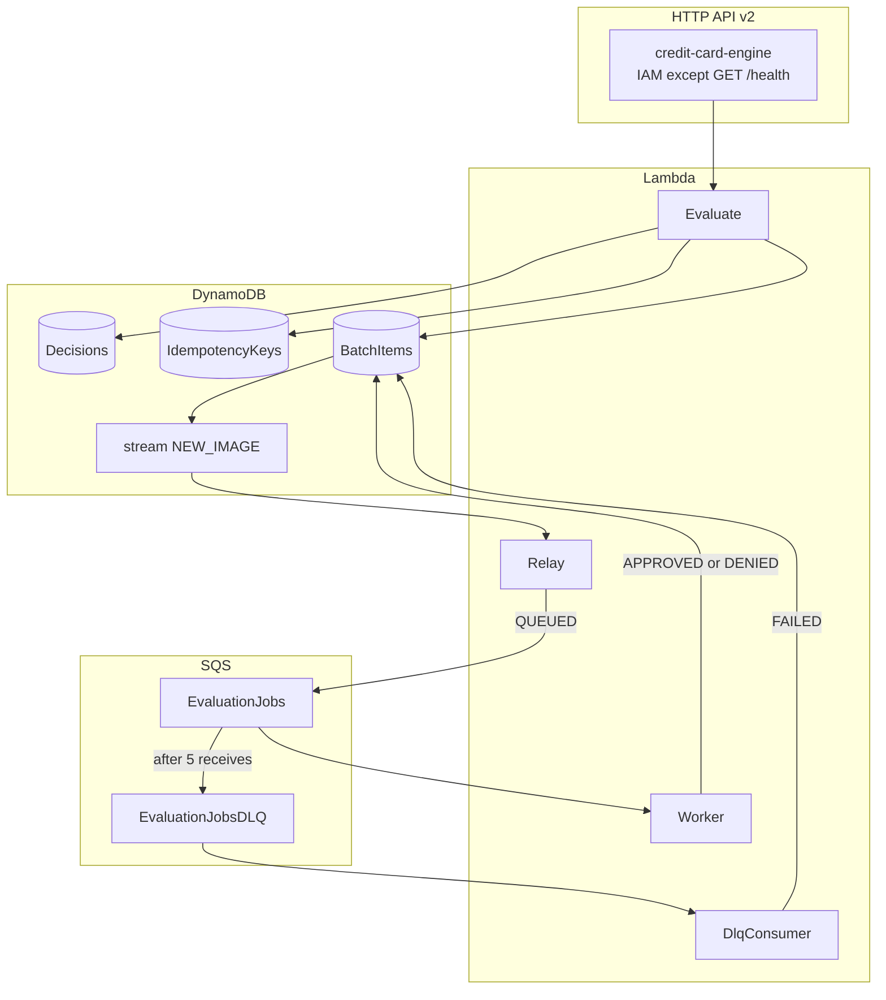
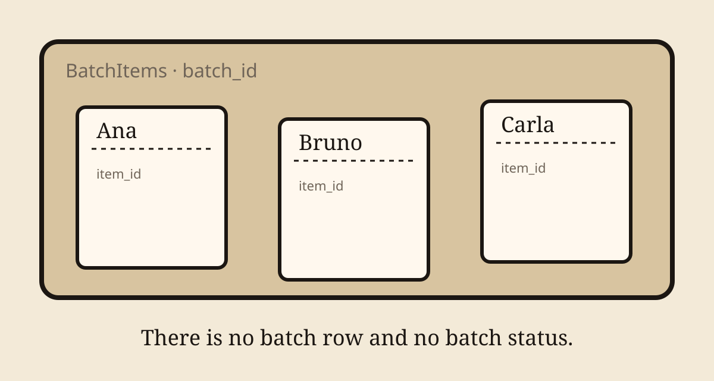
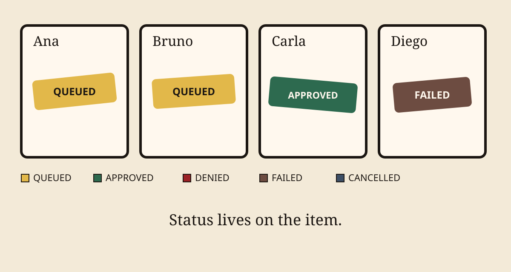
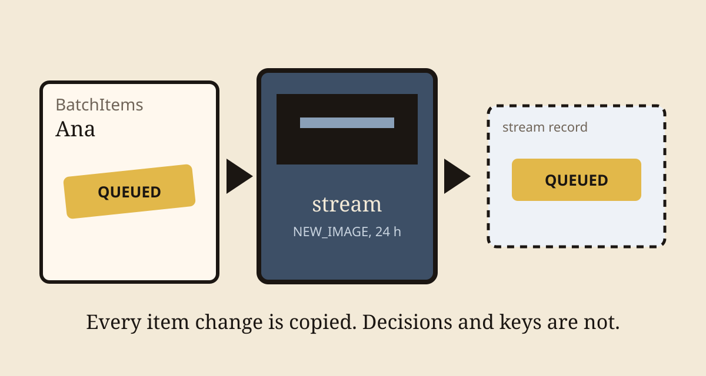
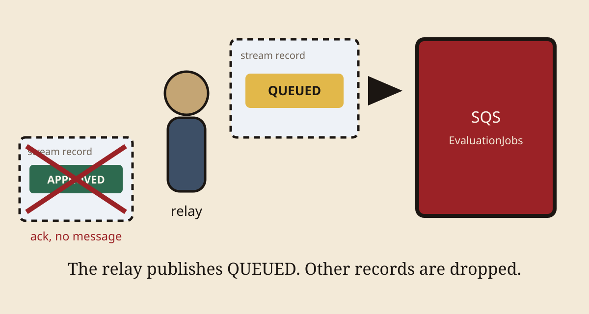
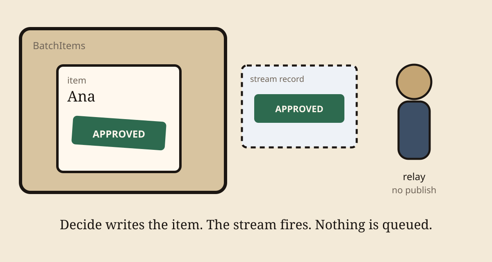
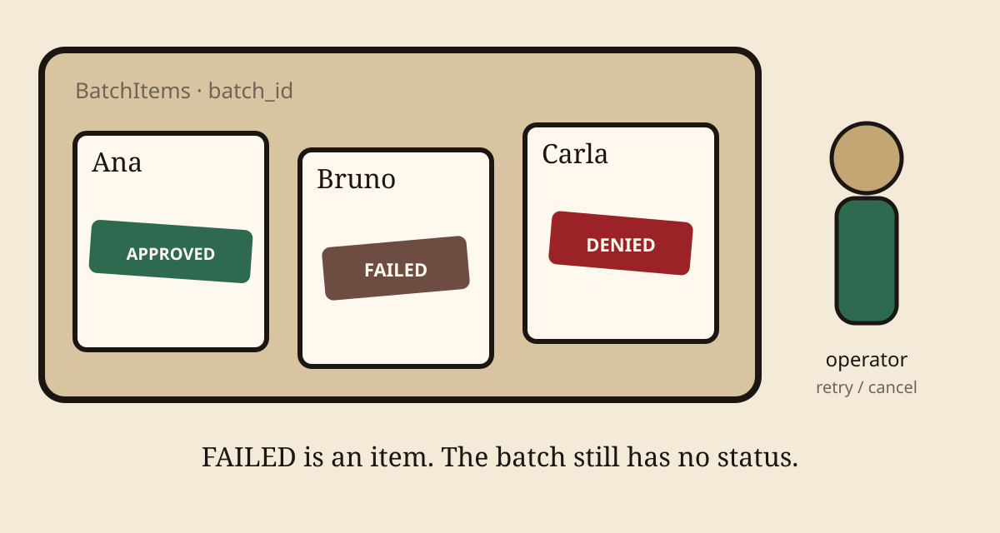
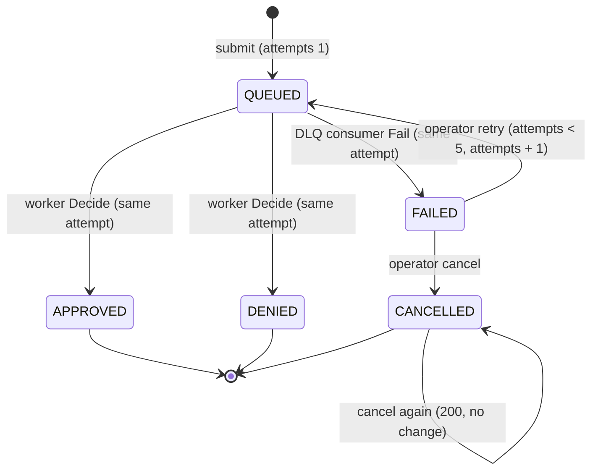
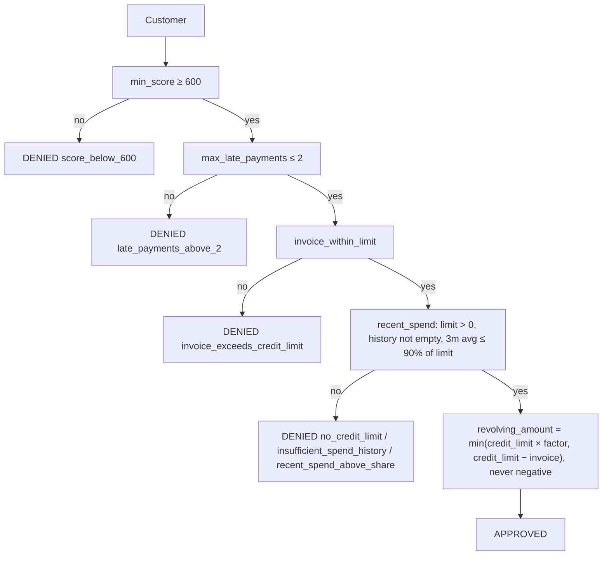
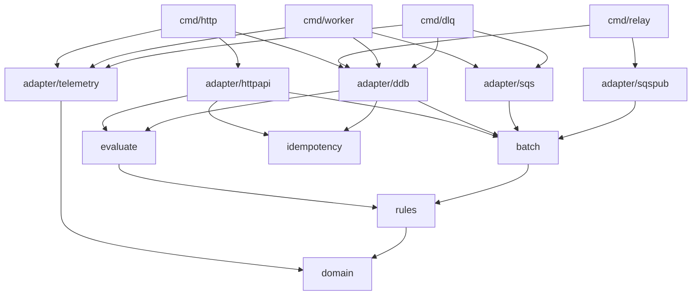

# Architecture

This is a revolving-credit evaluation. The product lives in `apps/engine/`,
in two modules, `evaluate` and `batch`. CDK in `packages/infra-iac/` describes
the stack. This file, `apps/engine/architecture_test.go`, and the stack
describe the cut.

## Runtime

The stack is HTTP API v2, four Lambdas, three DynamoDB tables, and two SQS
queues. Evaluate writes the tables and never the queue. Only `BatchItems` has
a stream. `NEW_IMAGE` is the DynamoDB view: each record is the item after the
write.



`POST /evaluations` evaluates one customer and stores the decision before it
answers. `POST /evaluations/batch` stores one `BatchItems` row per customer
and answers `202`. The stream, Relay, SQS, and Worker decide those items
afterwards.

The sync path fails closed
([ADR 0001](adr/0001-fail-closed-and-operator-driven-item-recovery.md)).
`POST /evaluations` is under a 1 s SLO. If the write to `Decisions` fails, the
handler returns `503 {"error":"decision_not_recorded"}` and no decision. A
decision that was never recorded cannot be audited. On the batch path the handler has
already answered `202`, so a failure becomes a redelivery and, after 5
receives, a failed item.

## How a batch moves

A batch is a list of customers submitted together. It is accepted whole or
rejected whole. There is no batch row. The items are the batch. Each row's
partition key is `batch_id`, its sort key is `item_id`. Progress is the status
of those rows. The batch itself has no status.



Each item's status is `QUEUED`, `APPROVED`, `DENIED`, `FAILED`, or `CANCELLED`.
`GET /batches/{id}/items` pages the partition. `?status=` queries the
`by-status` GSI, whose key is `batch_status` = `<batch_id>#<status>`. A decided
item carries its decision as its status. Only a `FAILED` item can be retried or
cancelled.



`POST /evaluations/batch` accepts at most `BATCH_SIZE` customers (default 100,
max 1000). A larger body returns
`422 {"error":"batch_too_large","max":<BATCH_SIZE>}` and stores nothing. `batch.Submit` creates a `batch_id` and one version 7 `item_id` per
customer, writes each row as `QUEUED`, and returns
`202 {"batch_id","queued","item_ids"}`. It does not publish to SQS. The write
is the event. A `PutItem` on `Decisions` or `IdempotencyKeys` does not enter
this path.

If a write fails partway, the store deletes the rows it wrote on a 2 s
deadline of its own. If that delete fails too, the rows stay and Worker
evaluates them. The log line `batch_rollback_failed` names the `batch_id`,
and the `EvaluateStoreBookkeeping` alarm fires. A store failure on the
request returns `503 {"error":"batch_not_recorded"}`.



The stream retains records for 24 hours. The event source mapping delivers
every item change to Relay (`cmd/relay`). `batch.Relay` publishes to
`EvaluationJobs` only when the new image's status is `QUEUED`: submit, retry,
and retry-failed. `APPROVED`, `DENIED`, `FAILED`, `CANCELLED`, `REMOVE`, and a
record it cannot read produce no message
([ADR 0004](adr/0004-relay-queued-items-from-the-table-stream.md)). An unreadable
record is logged as `stream_record_skipped` and dropped, so it does not block
its shard. A failed publish leaves the item `QUEUED`. The event source mapping delivers
that record again.

The SQS message has no customer data. It names `{batch_id, item_id, attempt}`.
`event_id` is `<batch_id>:<item_id>:<attempt>:<status>`. Worker loads the
item.



Worker (`cmd/worker`, `batch.Process`) reads the item with a consistent
`GetItem` and evaluates it. `Items.Decide` moves `QUEUED` to `APPROVED` or
`DENIED` on the same attempt and stores the result. That `UpdateItem` is
streamed too. Relay reads a non-`QUEUED` image and publishes nothing, so a
decision does not enqueue the item again.



If Worker cannot finish, SQS redelivers only the records listed in
`batchItemFailures`. After 5 receives the message lands on
`EvaluationJobsDLQ` (14-day retention). DlqConsumer (`cmd/dlq`,
`batch.DeadLetter`) moves `QUEUED` to `FAILED` on that attempt. Nothing
redrives the DLQ
([ADR 0001](adr/0001-fail-closed-and-operator-driven-item-recovery.md)).

A failed item has no decision. An operator retries it (`FAILED` to `QUEUED`,
`attempts+1`, at most 5) or cancels it. Retry writes `QUEUED` again, so the
stream and Relay enqueue the new attempt. There is no whole-batch cancel.



A record whose batch or item does not exist can never succeed. Worker treats
it like any other failure, so it reaches the DLQ after 5 receives. DlqConsumer
acknowledges that record, a record it cannot parse, and a record whose item
already moved on.

## Item status

Every transition is one conditional `UpdateItem` on the item's own row. No
transition writes a shared row, so workers that decide items of one batch in
parallel never write the same row. A repeated delivery fails the condition
and returns `ErrInvalidTransition`. `Process` treats that as success, so the
item is decided once. These conditions are the only copy of the status rules.
Tests run against Floci
([ADR 0002](adr/0002-keep-aws-behind-adapters-with-one-implementation.md)).



| Transition | Called by | Condition | Update |
|---|---|---|---|
| `Decide(batch_id, item_id, attempt, result)` | `batch.Process` (Worker) | `QUEUED` on `attempt` | `status=APPROVED` or `DENIED`, `result` |
| `Fail(batch_id, item_id, attempt)` | `batch.DeadLetter` (DlqConsumer) | `QUEUED` on `attempt` | `status=FAILED` |
| `Retry(batch_id, item_id, attempt)` | `batch.Retry`, `batch.RetryFailed` | `FAILED` on `attempt`, `attempts < 5` | `status=QUEUED`, `attempts+1` |
| `Cancel(batch_id, item_id)` | `batch.Cancel` | `FAILED`. Cancelling a `CANCELLED` item succeeds with no change | `status=CANCELLED` |

A retry's message carries the new attempt. A late message for an older
attempt fails `Decide`, so only the current attempt can decide the item.

`GET /batches/{id}/items` returns one page in submission order, with no batch
status and no totals
([ADR 0003](adr/0003-list-batch-items-by-page.md)). `?status=` queries the
`by-status` index, so nothing is read and then dropped
([ADR 0007](adr/0007-list-items-by-status-from-an-index.md)). The index is
eventually consistent. An unknown `batch_id` is `404`. A known batch with no
items in that status is `200` with no items.

## Decision

`rules.NewPolicy()` builds a `rules.Policy` from an ordered list of rules and
the score bands. Each rule denies with a stable reason code or passes.
`Policy.Evaluate` applies them in order. The first rule that denies decides,
with one reason. The amount is computed only if every rule passes. To add a
rule, write one `Rule` function and add it to the list in `NewPolicy()`.



The score bands size an approval. A higher score gets a larger share of the
credit limit, capped at `credit_limit − current_invoice` and never negative.

| Score | Factor |
|---|---|
| ≥ 800 | 80% |
| 700 to 799 | 50% |
| 600 to 699 | 30% |
| < 600 | never reaches here. `min_score` denies |

Money is integer cents. Reports and logs use a masked CPF (`390.***.***-05`),
never the raw CPF.

These cutoffs are documented here. This is not a real bureau.

1. Minimum score 600. Below that, revolving credit is already credit risk.
   One cutoff, testable, no model.
2. At most 2 late payments. Three or more means collections already started.
3. Current invoice at or under the credit limit. Revolving credit on top of
   an over-limit invoice increases exposure with no collateral.
4. Recent spend at or under 90% of the credit limit, average of the last 3
   months. A customer already consuming the limit is revolving in practice. A
   credit limit of zero or less denies with `no_credit_limit`. An empty spend
   history denies with `insufficient_spend_history`.

Change a cutoff by editing its argument or a band in `rules.NewPolicy()`.
Change the policy with a new rule constructor in its own file plus one entry
in that list.

## Data model

Three DynamoDB tables, one per port
([ADR 0006](adr/0006-one-table-per-port.md)). All are on-demand, with AWS
managed encryption, and every key attribute is a string.

| Table | Keys | Attributes | Stream | TTL | Point-in-time recovery |
|---|---|---|---|---|---|
| `Decisions` | `decision_id` | `customer` (input JSON), `result` (decision JSON) | no | no | yes |
| `BatchItems` | `batch_id`, `item_id` | `customer` (input JSON), `status`, `batch_status` (`<batch_id>#<status>`), `attempts`, `queued_at`, `result` once decided | `NEW_IMAGE`, to Relay | no | yes |
| `IdempotencyKeys` | `idempotency_key` | `fingerprint`, `owner`, `state`, `lease_until`, `expires_at`, `status_code` and `body` once `DONE` ([ADR 0005](adr/0005-idempotency-key-claimed-with-a-conditional-write.md)) | no | `expires_at` | no |

`BatchItems` has one global secondary index, `by-status`: partition key
`batch_status`, sort key `item_id`, every attribute projected. Every write
that sets `status` sets `batch_status` in the same request. `batch_status` is
the index key for that item. It is not a status of the batch.

A batch is its items. An unknown batch is a `batch_id` with no items.
`item_id` is a version 7 UUID, so a Query on `batch_id` returns items in
submission order.

Stored decisions and batch items keep the full CPF and name with no TTL.
They are the audit record. An `IdempotencyKeys` item holds the fingerprint
and the replay body for 24 hours, including the name on a replayed
`POST /evaluations`. That table has no stream. Every API response masks the
CPF as `390.***.***-05` (first three and last two digits).

## Packages

The modules declare ports. The adapters implement them. `domain`, `rules`,
`idempotency`, `evaluate`, and `batch` do not import AWS. A new rule is a
constructor that returns a `Rule`, added to the list in `rules.NewPolicy()`.

`architecture_test.go` enforces this graph (`cmd` also imports
`adapter/awsconfig`, left out below):



| Package | Role |
|---|---|
| `internal/domain` | Customer, validation, Result. No I/O. |
| `internal/rules` | `Policy.Evaluate`. `NewPolicy()` is the product policy. |
| `internal/evaluate` | Single evaluation. Ports: `DecisionStore`, `Emitter`. |
| `internal/idempotency` | `Idempotency-Key`. Port: `Store`. |
| `internal/batch` | Submit, relay, process, dead-letter, retry, cancel, list. Ports: `Items`, `Publisher`, `Emitter`. |
| `internal/adapter/httpapi` | HTTP API v2. Validates, wraps both `POST` evaluation routes in `idempotency`, maps errors. |
| `internal/adapter/ddb` | `ddb.Decisions`, `ddb.Items`, `ddb.Keys`. Conditional item transitions. Stream records become item events. |
| `internal/adapter/sqs` | Worker calls `batch.Process`. DlqConsumer calls `batch.DeadLetter`. |
| `internal/adapter/sqspub` | `batch.Publisher`. Only Relay uses it. |
| `internal/adapter/telemetry` | `EMF` implements both `Emitter` ports. One JSON line per event, no AWS SDK. |
| `internal/flocitest` | Test-only Floci harness. |
| `cmd/http` `cmd/relay` `cmd/worker` `cmd/dlq` | Composition root. JSON `slog` on stdout. |
| `packages/infra-iac` | CDK stack. |
| `packages/loadtest` | k6. [loadtest.md](loadtest.md). |

To regenerate the edges, run inside the Dev Container:

```bash
cd apps/engine && go list -f '{{.ImportPath}}: {{join .Imports " "}}' ./cmd/... ./internal/...
```

## API

Wire types are `events.APIGatewayV2HTTPRequest` and `HTTPResponse`.

The HTTP adapter validates every customer with `domain.Customer.Validate()`
before it calls `evaluate` or `batch`. Validation does no I/O. An invalid
customer is never evaluated and gets no decision. The CPF is normalized to
11 bare digits (`390.533.447-05` → `39053344705`) first.

| Field | Code | When |
|---|---|---|
| `cpf` | `invalid_length` | not 11 digits after removing dots and dash |
| `cpf` | `repeated_digits` | all 11 digits are the same (`11111111111`) |
| `cpf` | `invalid_check_digits` | either mod 11 check digit is wrong |
| `name` | `required` | empty or blank |
| `credit_score`, `current_invoice_cents`, `credit_limit_cents`, `late_payments` | `negative` | below zero |
| `monthly_spend_cents[i]` | `negative` | entry `i` is below zero |

`POST /evaluations` returns `400 {"error":"invalid_json"}` for malformed JSON
and `422 {"error":"invalid_customer","violations":[...]}` for an invalid
customer. If any customer in `POST /evaluations/batch` is invalid, the whole
batch is rejected with `422`, each violation carries the customer's `index`,
and nothing is stored.

```json
{"error":"invalid_customer","violations":[{"index":1,"field":"cpf","code":"invalid_check_digits"}]}
```

| Method | Path | Body | Response |
|---|---|---|---|
| `GET` | `/health` | — | `{"status":"ok"}` |
| `POST` | `/evaluations` | one `Customer` | `200` + `{decision_id, ...Result}` (sync, 1 s SLO); `400` malformed JSON; `422` invalid customer; `503 {"error":"decision_not_recorded"}`. Takes `Idempotency-Key` |
| `GET` | `/evaluations/{id}` | — | `200` + the same `{decision_id, ...Result}`; `404 {"error":"not_found"}` |
| `POST` | `/evaluations/batch` | `{customers:[...]}` or array, at most `BATCH_SIZE` (default 100, max 1000) | `202` + `{batch_id, queued, item_ids}` in customer order; `422` with indexed violations or `batch_too_large`; `503 {"error":"batch_not_recorded"}`. Takes `Idempotency-Key` |
| `GET` | `/batches/{id}/items?status=&limit=&cursor=` | — | `200` + one page of items. `?status=` filters by item status. `400` for a bad status, limit, or cursor; `404 {"error":"not_found"}` |
| `POST` | `/batches/{id}/items/{item_id}/retry` | — | `202 {"attempts","item_id"}`; `409 {"error":"invalid_transition"}` if not `FAILED`; `409 {"error":"max_attempts_reached"}` at 5 attempts; `404` |
| `POST` | `/batches/{id}/items/{item_id}/cancel` | — | `200 {"item_id","status":"CANCELLED"}`, again `200` on a cancelled item; `409 {"error":"invalid_transition"}` otherwise; `404` |
| `POST` | `/batches/{id}/retry-failed` | — | `202 {"requeued": n}`; `404` |

Both `POST /evaluations` routes take an optional `Idempotency-Key` header
([ADR 0005](adr/0005-idempotency-key-claimed-with-a-conditional-write.md)).
The same key with the same route and body replays the first `2xx` response
with `idempotent-replayed: true`. A non-`2xx` response frees the key. Keys
live 24 hours.

- Same key, other route or body: `422 {"error":"idempotency_key_reused"}`.
- Same key while the first request still runs: `409 {"error":"idempotency_key_in_progress"}`.
- Empty, longer than 255 characters, or not visible ASCII:
  `400 {"error":"invalid_idempotency_key","max_length":255}`.
- Store cannot claim the key: `503 {"error":"store_failed"}`, and the route
  does not run.

One page of items, `GET /batches/{id}/items?limit=2`:

```json
{
  "batch_id": "b5e2d9a0-1c3f-4e8b-a7d6-9f0c2e4b8a13",
  "items": [
    {"item_id": "0199a1b2-7c3d-7e4f-8a5b-6c7d8e9f0a1b", "name": "Ana Souza", "cpf_masked": "390.***.***-05",
     "status": "APPROVED", "reasons": ["eligible"], "revolving_amount_cents": 250000, "attempts": 1},
    {"item_id": "0199a1b2-7c3d-7e4f-8a5b-6c7d8e9f0a1c", "name": "Bruno Lima", "cpf_masked": "123.***.***-09",
     "status": "FAILED", "reasons": [], "revolving_amount_cents": 0, "attempts": 1}
  ],
  "next_cursor": "MDE5OWExYjItN2MzZC03ZTRmLThhNWItNmM3ZDhlOWYwYTFj"
}
```

The last page has no `next_cursor`. The cursor is the last returned
`item_id`, base64url-encoded. An `item_id` that is not a UUID is `404`
before any store call.

## Observability

CDK enables X-Ray tracing (Active) on all four Lambdas. The HTTP request's
trace ends at the table write. A stream record carries no trace header.
Relay starts the batch's trace. `sqspub` copies `_X_AMZN_TRACE_ID` onto every
message as `AWSTraceHeader`. Worker and DlqConsumer continue that trace.

Each Lambda logs JSON with `log/slog` on stdout. Keys are `snake_case`. A
handler that returns a `5xx` logs the cause once at `error`, with no customer
name or full CPF. Worker and DlqConsumer log `record_failed` at `error` with
`message_id`, `error`, and `batch_id` and `item_id` when the body parsed.
They never log the body or customer fields.

Each recorded decision writes one CloudWatch Embedded Metric Format line in
namespace `CreditCardEngine`, through the modules' `Emitter` port. A batch
item writes it only when `Items.Decide` succeeds. A single evaluation writes
it only after the decision is recorded.

| Metric | When | Dimensions |
|---|---|---|
| `Approved` | decision is approved | none |
| `Denied` | decision is denied | none |
| `DenyByReason` | decision is denied | `reason` |
| `DecisionLatencyMs` | every recorded decision | none |
| `ItemsFailed` | `batch` moved the item to `FAILED` (DlqConsumer) | none |
| `ItemEndToEndMs` | a batch item is decided: time from `queued_at` (submit or retry) to the decision | none |

Decision line properties: `decision`, `reason`, `latency_ms`, `cpf_masked`,
and either `decision_id` (sync) or `batch_id` and `item_id` (batch).
Failed-item line properties: `batch_id`, `item_id`, `attempt`. Logs, EMF
properties, and metric dimensions never include a customer name or a full
CPF.

Dashboard `CreditCardEngine` graphs evaluations per minute, approval rate,
`DenyByReason`, `DecisionLatencyMs` p99, `ItemEndToEndMs` p99, oldest queued
message age, HTTP Lambda p99 duration, API 5xx, DLQ visible messages, and
`ItemsFailed`. Missing data is not breaching.

| Alarm | Fires when |
|---|---|
| `Api5xx` | API Gateway 5xx ≥ 1 in 1 minute |
| `WorkerErrors` | Worker errors ≥ 1 in 1 minute |
| `DlqConsumerErrors` | DlqConsumer errors ≥ 1 in 1 minute |
| `DlqVisible` | DLQ visible messages > 0 for 5 minutes |
| `EvaluateLatency` | Evaluate p99 > 800 ms for 3 minutes (sync SLO is 1 s) |
| `RelayIteratorAge` | Relay is more than 60 s behind the table stream for 3 minutes |
| `QueueBacklog` | the oldest `EvaluationJobs` message is older than 60 s for 3 minutes |
| `ItemEndToEnd` | batch item p99 from queued to decided > 5 s for 3 minutes (the batch SLO) |
| `RelaySkippedRecords` | Relay logs `stream_record_skipped` (a log metric filter) |
| `BatchItemsThrottled` | `BatchItems` throttles requests in 3 consecutive minutes |
| `EvaluateStoreBookkeeping` | Evaluate logs `batch_rollback_failed`, `idempotency_complete_failed`, or `idempotency_release_failed` (a log metric filter) |

`RelaySkippedRecords` and `EvaluateStoreBookkeeping` count failures that are
logged and acknowledged, so no Lambda error or iterator age shows them.
Floci's CloudFormation stubs `AWS::Logs::MetricFilter`, so they exist only on
AWS.

## Evaluation criteria

| Criterion | How the design answers |
|---|---|
| Latency ≤ 1 s | The sync path evaluates in memory and makes one DynamoDB write, or three with an `Idempotency-Key` (claim, decision, complete). Lambda timeout 3 s, 256 MB, arm64. HTTP p99 is alarmed at 800 ms. The batch path answers after its `BatchWriteItem` calls. Each item's time from queued to decided is `ItemEndToEndMs`, alarmed at p99 > 5 s. See [loadtest.md](loadtest.md). |
| Accuracy | Customers validated at the edge (CPF check digits, no negatives). Deterministic rules. Table tests in `domain` and `rules`. Stable reason code per rule. |
| Scale 10k/min | Evaluate writes the items (`202`). Relay publishes from the stream. Worker takes up to 50 messages per invocation (1 s window) and handles them concurrently. DynamoDB is on-demand. Stage throttle is 1200 rps / 2400 burst. On AWS, Lambda scales an SQS source to 5 concurrent batches and then adds up to 300 invocations a minute, up to 1,250. Floci cannot show this, and there is no AWS account in this cut: [loadtest.md](loadtest.md) has the local runs. |
| Extensibility | Ordered `rules.Rule` list and score bands in `rules.NewPolicy()`. `architecture_test.go` keeps domain, rules, and the modules off AWS. |
| LGPD | CPF masked on `Result` and in logs. Encryption at rest on the tables and both queues (SSE-SQS). The queues deny requests not over TLS. IAM authorizer on every HTTP route except `/health`. Full CPF and name stay in DynamoDB. Queue messages and Relay carry no customer data. Evaluate has no access to the queue. |
| Observability | 14-day logs. One EMF line per decision and per failed item. Dashboard `CreditCardEngine`. Alarms in [Observability](#observability). |
| Resilience | `rules` has no I/O. `evaluate` records after the decision. The sync path fails closed with `503`. On batch, SQS isolates Evaluate from Worker. Worker reports partial batch failures. A record that fails 5 receives goes to the DLQ. DlqConsumer marks the item `FAILED` for an operator to retry or cancel. Submit and retry only write the item. The stream retries a failed publish for up to 24 h ([ADR 0004](adr/0004-relay-queued-items-from-the-table-stream.md)). Every transition is conditional. On-demand tables, with point-in-time recovery (35 days) on `Decisions` and `BatchItems`. |

[loadtest.md](loadtest.md) has every load test run and the limits of Floci
behind the numbers. Floci serves about 10 Lambda invocations a second, so a
local run measures the emulator, not the engine.

## Infra (CDK Go)

`packages/infra-iac/` is the CDK app. `cdk.json` points at
`go run ./packages/infra-iac`. One stack, `us-east-1`. Run steps live in
[README.md](../README.md).

| Resource | Choice | Why |
|---|---|---|
| HTTP API v2 | stage throttle 1200 rps / 2400 burst | Floci covers it. |
| Lambda `provided.al2023` arm64 | timeout 3 s, 256 MB | SLO is 1 s. 3 s is a safety cap, not the budget. |
| Reserved concurrency | Evaluate 8, Worker 4, Relay 2, DlqConsumer 2 | Floci only (`AWS_ENDPOINT_URL` set at synth). Floci starts one container per concurrent invoke. Real AWS stays unreserved. |
| DynamoDB on-demand | three tables, see [Data model](#data-model) | One table per port ([ADR 0006](adr/0006-one-table-per-port.md)). |
| IAM authorizer | every route except `GET /health` | SigV4 on `execute-api`. `/health` stays open for probes. |
| Table stream + Relay | `NEW_IMAGE`, batch 100 or 1 s, `TRIM_HORIZON`, bisect on error, `ReportBatchItemFailures` | The outbox of [ADR 0004](adr/0004-relay-queued-items-from-the-table-stream.md). |
| Worker + `EvaluationJobs` | batch 50 with a 1 s window (10 on Floci), `ReportBatchItemFailures`, visibility timeout 19 s | Worker reads, evaluates, and decides each item. |
| `EvaluationJobsDLQ` | `maxReceiveCount=5`, 14-day retention | A record that keeps failing becomes a failed item ([ADR 0001](adr/0001-fail-closed-and-operator-driven-item-recovery.md)). |
| Queue encryption | SSE-SQS on both queues, deny requests not over TLS | Encryption at rest and in transit with no key to manage. |
| Point-in-time recovery | `Decisions` and `BatchItems`, 35 days | Restores the table after a bad write. |
| Grants | no `Scan` | Evaluate on the three tables. Worker `GetItem` and `UpdateItem` on `BatchItems`. DlqConsumer `UpdateItem` on `BatchItems`. Relay only the `BatchItems` stream. Only Relay sends to the queue. The stack test pins each list. |

## Rejected

| Alternative | Why not |
|---|---|
| SAM + CDK | Two IaC tools for the same stack. |
| REST API | Higher overhead. This cut does not need WAF or a usage plan. |
| RDS or Postgres | Latency and a connection pool for one Put per request. |
| Customer managed key | Does not change encryption this cut needs, and costs more in the demo. |
| VPC | An ENI on cold start blows the 1 s SLO. The tables do not need a private network. |
| `httpadapter` + `net/http` | Hides the HTTP API contract. The wire types are the AWS events. |
| Event sourcing, SNS, or projectors | Closes none of the NFRs above. |
| Cognito + WAF + custom domain | IAM auth is on the HTTP API. Cognito, WAF, and a custom domain remain out of scope. |
