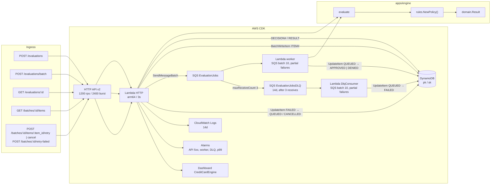
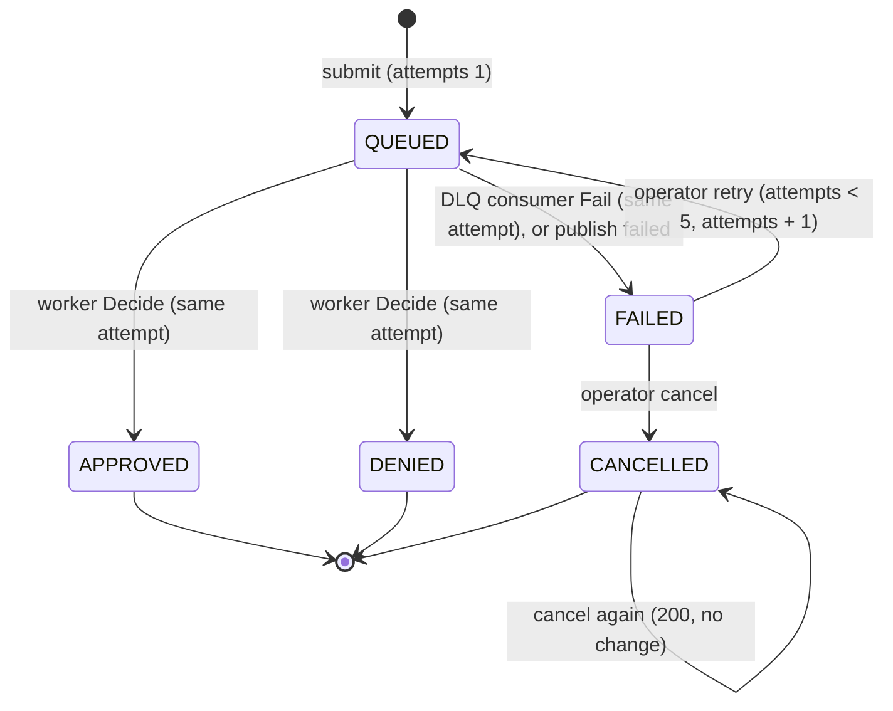
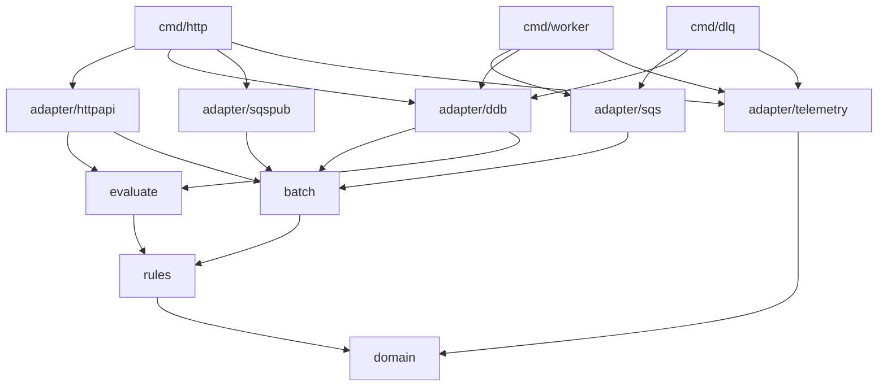
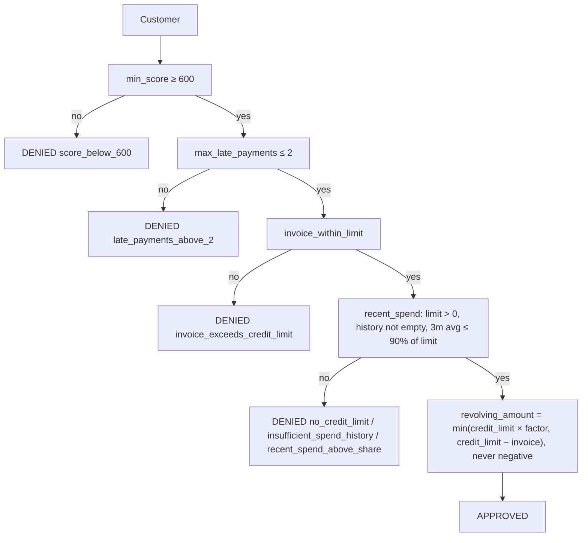

# Architecture

A revolving-credit evaluation. The cut is the rules engine, the batch item list, and
the AWS infra that backs the criteria.

IaC is CDK in Go (`packages/infra-iac/`). The product lives in
`apps/engine/`, split into two deep modules: `evaluate` and `batch`. This file, `apps/engine/architecture_test.go`,
and the stack describe the cut.

## Cut

| Piece | Role |
|---|---|
| `internal/domain` | Customer profile, its validation, and the decision. No I/O. |
| `internal/rules` | `Policy.Evaluate(Customer) Result`: ordered `Rule` funcs (the first that denies decides) plus the score bands that size an approval. `NewPolicy()` is the product policy. Pure. |
| `internal/evaluate` | The single evaluation. `Evaluate(ctx, customer)` applies the policy, records the decision, and only then returns it (fail closed). `Get` reads a recorded decision. Declares its ports: `DecisionStore` (`Save`, `Get`) and `Emitter`. |
| `internal/batch` | The batch and its items. `Submit`, `Process(Attempt)`, `DeadLetter(Attempt)`, `Retry`, `RetryFailed`, `Cancel`, `ListItems`. Gives each item a version 7 `item_id`, stores before it publishes, fails an item whose publish failed, builds each `Attempt` message, pages the item list, and emits the item metrics. Declares its ports: `Items`, `Publisher`, `Emitter` ([ADR 0001](adr/0001-fail-closed-and-operator-driven-item-recovery.md)). |
| `internal/adapter/httpapi` | HTTP API v2. Validates customers, calls `evaluate` or `batch`, and maps their errors to status codes. |
| `internal/adapter/sqs` | One queue consumer with two roles: `Worker` (queue, calls `batch.Process`) and `DeadLetters` (DLQ, calls `batch.DeadLetter`). Reports partial batch failures. |
| `internal/adapter/ddb` | Implements `batch.Items` and `evaluate.DecisionStore` on one DynamoDB table. The item status transitions are its conditional updates. |
| `internal/adapter/sqspub` | Implements `batch.Publisher` with `SendMessageBatch`. |
| `internal/adapter/telemetry` | `EMF` implements both `Emitter` ports. One JSON line per decision or failed item, no AWS SDK. |
| `internal/flocitest` | Test-only. AWS config for Floci, fresh tables and queues, and faults injected in the SDK. |
| `cmd/http` `cmd/worker` `cmd/dlq` | Composition root. JSON `slog` on stdout. |
| `packages/infra-iac` | CDK. HTTP API with IAM authorizer except `/health`, three Lambdas, SQS with its DLQ, DynamoDB, logs, dashboard, alarms. |
| `packages/loadtest` | k6 at `LOADTEST_RATE` req/s (default 100 locally) on `POST /evaluations/batch` for 10 s, 8 VUs on Floci. Local gate is p95 under 2 s and under 1% errors. p99 under 800 ms is the real-AWS NFR. The 1000 req/s NFR run (10k requests) is `LOADTEST_RATE=1000 make loadtest` against a real AWS stack. |

## Runtime



Two paths, on purpose:

- Sync (`POST /evaluations`). The handler evaluates one customer under a 1 s
  SLO and returns the decision now. The decision is stored under a new
  `decision_id` and read back with `GET /evaluations/{id}`.
- Batch (`POST /evaluations/batch`, then SQS, then the worker, then
  `GET /batches/{id}/items`). HTTP stores the batch items and enqueues.
  This is the loadtest path (1000 req/s NFR on real AWS, 100 req/s by
  default on Floci).

DynamoDB writes after the decision. The sync path fails closed
([ADR 0001](adr/0001-fail-closed-and-operator-driven-item-recovery.md)).
If the decision cannot be stored, `POST /evaluations` returns
`503 {"error":"decision_not_recorded"}` and no decision. A decision that was
never recorded cannot be audited. On batch, HTTP already returned `202`. SQS
redelivers the record to the worker, then the DLQ takes the record (see
[Resilience](#resilience)).

### Batch submission

`POST /evaluations/batch` accepts at most `BATCH_SIZE` customers (default
100, max 1000). A larger batch returns
`422 {"error":"batch_too_large","max":<BATCH_SIZE>}` and nothing is stored or
queued. The CDK stack passes `BATCH_SIZE` from the synth environment to the
HTTP Lambda and fails the synth on a value outside 1..1000. A bad value also
fails the Lambda at startup. `scripts/floci.env` defaults `BATCH_SIZE` to 100.
`BATCH_SIZE=1000 make local-deploy` raises the cap.

Then `batch.Submit`:

1. Creates a `batch_id`, and one `item_id` per customer with `uuid.NewV7`.
   Version 7 UUIDs sort in the order they were made, so item IDs follow the
   submitted array.
2. Stores one `ITEM#<item_id>` row per customer (`status=QUEUED`,
   `attempts=1`, the customer input) with `BatchWriteItem`, 25 items per call,
   8 calls in flight. There is no batch row. The store retries
   `UnprocessedItems` with backoff. If a write fails, the store queries the
   batch partition and deletes leftover rows so a retry does not hit
   half-written keys. If that delete also fails, the leftover rows make a
   half-written batch readable, but its `batch_id` never reached a caller:
   `Submit` returned `503`.
3. Publishes one message per item, `{batch_id, item_id, attempt, customer}`,
   with `SendMessageBatch`, 10 messages per call, 10 calls in flight. The
   `item_id` is also the entry `Id`, so the publisher returns the item IDs
   that failed.
4. Calls `Items.Fail(batch_id, item_id, 1)` for exactly the items whose
   publish failed, so no item stays `QUEUED` with no message behind it.
5. Returns `202 {"batch_id","queued","item_ids"}`, where `queued` counts the
   published items and `item_ids` follow the submitted customers. An item
   whose publish failed shows `FAILED` in the list, and an operator retries
   it.

If storing the batch fails, the handler returns
`503 {"error":"batch_not_recorded"}` and publishes nothing. If marking a
failed publish `FAILED` also fails, the handler returns
`503 {"error":"enqueue_failed"}`.

Items are stored before any message is published, so a message never names an
item that does not exist. No step makes one call per customer. Only a failed
publish costs one `Fail` per item.

### Batch item status

The worker hands the message to `batch.Process`, which evaluates the attempt and calls
`Items.Decide(batch_id, item_id, attempt, result)`. One conditional
`UpdateItem` moves the item from `QUEUED` to its decision, `APPROVED` or
`DENIED`, and stores the result. The update applies only if the item is
`QUEUED` on the same attempt. A repeated delivery fails that condition and
returns `ErrInvalidTransition`. `Process` treats that as success, so the item
is decided once and its metric is emitted once.

Every transition is one `UpdateItem` on the item's own `ITEM#` row,
conditional on its current status and on attempt where that applies. No
transition writes a shared row. Workers that decide items of
one batch in parallel therefore never write the same row. Two operators, or an operator and a late
delivery, cannot both win a transition. These conditions are the only copy of
the item status rules: there is no in-memory store, and tests run against
Floci ([ADR 0002](adr/0002-keep-aws-behind-adapters-with-one-implementation.md)).



| Transition | Called by | Condition | Update |
|---|---|---|---|
| `Decide(batch_id, item_id, attempt, result)` | `batch.Process` (worker) | `QUEUED` on `attempt` | `status=APPROVED` or `DENIED`, `result` |
| `Fail(batch_id, item_id, attempt)` | `batch.DeadLetter` (DLQ consumer), and `batch` after a failed publish | `QUEUED` on `attempt` | `status=FAILED` |
| `Retry(batch_id, item_id, attempt)` | `batch.Retry`, `batch.RetryFailed` | `FAILED` on `attempt`, `attempts < 5` | `status=QUEUED`, `attempts+1` |
| `Cancel(batch_id, item_id)` | `batch.Cancel` | `FAILED`. Cancelling a `CANCELLED` item succeeds with no change | `status=CANCELLED` |

A retry's message carries the new attempt. A late message for an older attempt
fails the `Decide` condition, so only the current attempt can decide the item.
A failed item keeps its attempts, so the list shows how many passes it took.

### Item list

`GET /batches/{id}/items` returns one page of items in submission order
([ADR 0003](adr/0003-list-batch-items-by-page.md)). A batch has no status and
no totals: each item carries its own status and revolving amount. A caller
knows the batch is done when `?limit=1&status=QUEUED` returns no items.

`batch.ListItems` asks `Items.Page` for at most `limit` items (100 by default,
1000 at most) after the cursor's item. `Page` runs a `Query` on
`pk = BATCH#<batch_id>` and `begins_with(sk, "ITEM#")`, with
`#status = :status` as a filter when `?status=` is set. Query's `Limit`
counts rows before the filter, so `Page` repeats the Query until the page is
full or `LastEvaluatedKey` is empty. A 1 MB response ends a Query early the
same way. The cursor is the last returned `item_id`, base64url-encoded. The
server builds the `ExclusiveStartKey` from the path's `batch_id` and that ID.

A batch always has at least one item, so on the first page a `Query` that
scanned no rows (`ScannedCount = 0`) means an unknown batch: `404`. Rows
scanned with none matching the filter is a `200` with no items.

### Resilience

The worker returns `events.SQSEventResponse` and lists in
`batchItemFailures` only the records that failed. A decided record and a
redelivery that hits `ErrInvalidTransition` are not listed. The event source
has `ReportBatchItemFailures`, so SQS redelivers only the failed records.

`EvaluationJobs` sends a record to `EvaluationJobsDLQ` (14-day retention)
after `maxReceiveCount=3` receives. The `DlqConsumer` Lambda calls
`batch.DeadLetter` for each record, which calls
`Items.Fail(batch_id, item_id, attempt)` and makes the item `FAILED`. The DLQ
is a signal, not a
recovery path. Nothing redrives the DLQ
([ADR 0001](adr/0001-fail-closed-and-operator-driven-item-recovery.md)).

A record whose batch or item does not exist (for example left over from a
deleted stack) can never succeed. The worker treats that record like any
other failure, so the record reaches the DLQ after 3 receives instead of
looping forever. The DLQ consumer acknowledges that record, a record it
cannot parse, and a record whose item already moved on (decided, failed, or
retried on a newer attempt). The consumer reports a record as failed only
when the store write fails, so SQS retries that record within the DLQ's
retention.

`POST /batches/{id}/items/{item_id}/retry` reads the item
(`ITEM#<item_id>`), moves it `FAILED → QUEUED` on the next attempt, and
publishes `{batch_id, item_id, attempt, customer}`. An `item_id` that is not
a UUID is a `404` before any store call. If the publish fails, the handler
moves the item back to `FAILED`. The attempt stays counted. The handler
returns `503 {"error":"enqueue_failed"}`.

`POST /batches/{id}/retry-failed` reads the failed items with `Items.Page`
(`?status=FAILED`, pages of 1000). `RetryMany` moves them
`FAILED → QUEUED` with one conditional `UpdateItem` per item, 8 in flight.
The handler then publishes them with `SendMessageBatch` in chunks of 10. Items whose publish failed
go back to `FAILED` and are not counted in `requeued`. There is no whole-batch
cancel and no automatic cancel after the last attempt. Cancelling is always
an operator's call.

## Observability

CDK enables X-Ray tracing (Active) on all three Lambdas. The HTTP Lambda's
segment is the root of a batch. `sqspub` copies `_X_AMZN_TRACE_ID` onto every
message as the SQS `AWSTraceHeader` system attribute. The worker continues
that trace. If the message reaches the DLQ, the DLQ consumer continues the
same trace. An operator retry is a new HTTP invocation and a new trace.

Each Lambda logs JSON with `log/slog` on stdout. Keys are `snake_case`. A
handler that returns a `5xx` logs the cause once at `error`, with no customer
name or full CPF. The worker and DLQ consumer log `record_failed` at `error`
with `message_id`, `error`, and `batch_id` and `item_id` when the body parsed.
They never log the body or customer fields.

Each recorded decision writes one CloudWatch Embedded Metric Format line in
namespace `CreditCardEngine`, through the modules' `Emitter` port. A batch
item writes it only when `Items.Decide` succeeds, so a redelivered message is
not counted twice. A single evaluation writes it only after the decision is
recorded.

| Metric | When | Dimensions |
|---|---|---|
| `Approved` | decision is approved | none |
| `Denied` | decision is denied | none |
| `DenyByReason` | decision is denied | `reason` |
| `DecisionLatencyMs` | every recorded decision | none |
| `ItemsFailed` | `batch` moved the item to `FAILED` (DLQ consumer or a failed publish) | none |

Decision line properties: `decision`, `reason`, `latency_ms`, `cpf_masked`,
and either `decision_id` (sync) or `batch_id` and `item_id` (batch). Failed-item
line properties: `batch_id`, `item_id`, `attempt`. Logs, EMF properties, and
metric dimensions never include a customer name or a full CPF.

The CloudWatch dashboard `CreditCardEngine` shows evaluations per minute,
approval rate, `DenyByReason` by reason, `DecisionLatencyMs` p99, HTTP Lambda
p99 duration, API 5xx, DLQ visible messages, and `ItemsFailed`. Missing data
is not breaching. Alarms: API Gateway 5xx ≥ 1 in 1 minute; worker errors ≥ 1
in 1 minute; DLQ consumer errors ≥ 1 in 1 minute; DLQ visible messages > 0
for 5 minutes; HTTP Lambda p99 > 800 ms for 3 minutes.

## Data model

One DynamoDB table, `Decisions`, with generic keys `pk` (string) and `sk`
(string).

| `pk` | `sk` | Attributes |
|---|---|---|
| `DECISION#<decision_id>` | `RESULT` | `customer` (input JSON), `result` (decision JSON) |
| `BATCH#<batch_id>` | `ITEM#<item_id>` | `item_id`, `customer` (input JSON), `status`, `attempts`, `result` once decided |

A batch is its item rows. There is no batch row: an unknown batch is a
partition with no rows. `item_id` is a version 7 UUID, so a Query on the
partition returns items in submission order.

Each batch item stores the input and the item status together. Stored
decisions and batch items keep the full CPF and name with no TTL. They are
the audit record. Every API response masks the CPF (`***` + last 2 digits).

## Packages

The same DAG that `architecture_test.go` locks. `domain`, `rules`, `evaluate`,
and `batch` do not import AWS. The modules declare their ports, and the
adapters implement them.
A new rule is a constructor that returns a `Rule`, added to the list in
`rules.NewPolicy()`. The modules and adapters stay the same.



## Validation

The HTTP adapter validates every customer with `domain.Customer.Validate()`
before it calls `evaluate` or `batch`. Validation does no I/O and returns every
violation as `{field, code}`. An invalid customer is never evaluated and gets
no decision.

| Field | Code | When |
|---|---|---|
| `cpf` | `invalid_length` | not 11 digits after removing dots and dash |
| `cpf` | `repeated_digits` | all 11 digits are the same (`11111111111`) |
| `cpf` | `invalid_check_digits` | either mod 11 check digit is wrong |
| `name` | `required` | empty or blank |
| `credit_score`, `current_invoice_cents`, `credit_limit_cents`, `late_payments` | `negative` | below zero |
| `monthly_spend_cents[i]` | `negative` | entry `i` is below zero |

The CPF is normalized to 11 bare digits (`390.533.447-05` → `39053344705`)
before it reaches `evaluate` or `batch`.

`POST /evaluations` returns `400 {"error":"invalid_json"}` for malformed JSON
and `422 {"error":"invalid_customer","violations":[...]}` for an invalid
customer. If any customer in `POST /evaluations/batch` is invalid, the whole
batch is rejected with `422`, each violation carries the customer's `index`,
and nothing is stored or published.

```json
{"error":"invalid_customer","violations":[{"index":1,"field":"cpf","code":"invalid_check_digits"}]}
```

## Decision

`rules.NewPolicy()` builds a `rules.Policy` from the rule chain and the amount
policy. The chain is Chain of Responsibility. The first rule that denies
stops the chain, with one reason. The amount is computed only if every rule
passes.



`rules.ScoreBands` implements `rules.AmountPolicy`. A higher score gets a
larger share of the credit limit on revolving credit, capped at
`credit_limit − current_invoice` and never negative.

| Score | Factor |
|---|---|
| ≥ 800 | 80% |
| 700 to 799 | 50% |
| 600 to 699 | 30% |
| < 600 | never reaches here. `min_score` denies |

Money is integer cents. Reports and logs use a masked CPF (`***` + last 2
digits), never the raw CPF.

## Why these rules

Criteria are documented here. This is not a real bureau.

1. Minimum score 600. Below that, revolving credit is already credit risk.
   One cutoff, testable, no model.
2. At most 2 late payments. Recent late payments are the cheapest predictor
   of revolving default. Three or more means collections already started.
3. Current invoice at or under the credit limit. Granting revolving credit
   on top of an over-limit invoice increases exposure with no collateral.
4. Recent spend at or under 90% of the credit limit. A customer already
   consuming the limit is revolving in practice. Average of the last 3
   months, not a single month. A credit limit of zero or less denies with
   `no_credit_limit`. An empty spend history denies with
   `insufficient_spend_history` because there is no evidence to size the
   risk.

Change a cutoff by editing its argument or a band in `rules.NewPolicy()`.
Change the policy with a new rule constructor in its own file plus one entry
in that list.

## Evaluation criteria

| Criterion | How the design answers |
|---|---|
| Latency ≤ 1 s | Sync engine, no I/O on the sync path. Lambda timeout 3 s, 256 MB, arm64. p99 alarmed at 800 ms. |
| Accuracy | Customers validated at the edge (CPF check digits, no negatives). Deterministic rules. Table tests in `domain` and `rules`. Stable reason code per rule. |
| Scale 10k/min | NFR floor. The cut demonstrates 1000 req/s on batch. HTTP enqueues (202), the worker processes batch 10, DynamoDB is on-demand. Stage at 1200 rps / 2400 burst. The 1000 req/s NFR run is `LOADTEST_RATE=1000 make loadtest` against real AWS, 1000/s × 10 s = 10k requests (local default 100 req/s). |
| Extensibility | Ordered `rules.Rule` list and score bands, assembled in `rules.NewPolicy()`. `architecture_test.go` keeps domain, rules, and the modules off AWS. |
| LGPD | CPF masked on `Result` and in logs. Encryption at rest managed. IAM authorizer on every HTTP route except `/health`. Full CPF and name stay in DynamoDB and SQS. |
| Observability | 14-day logs. One EMF line per decision (`Approved`/`Denied`, `DenyByReason`, `DecisionLatencyMs`) and per failed item (`ItemsFailed`). Dashboard `CreditCardEngine`. Alarms on API 5xx, worker errors, DLQ consumer errors, DLQ depth, and HTTP p99 > 800 ms. |
| Resilience | `rules` has no I/O. `evaluate` records after the decision, and the sync path fails closed with `503`. On batch, SQS isolates HTTP from the worker. The worker reports partial batch failures, a record that fails 3 receives goes to the DLQ, and the DLQ consumer marks its item `FAILED` for an operator to retry or cancel. A failed publish marks the item `FAILED`, never leaves it `QUEUED`. Every transition is conditional. On-demand table. 5xx alarm on the sync path. |

## API

Wire types are `events.APIGatewayV2HTTPRequest` and `HTTPResponse`.

| Method | Path | Body | Response |
|---|---|---|---|
| `GET` | `/health` | — | `{"status":"ok"}` |
| `POST` | `/evaluations` | one `Customer` | `200` + `{decision_id, ...Result}` (sync, 1 s SLO); `400` malformed JSON; `422` invalid customer; `503 {"error":"decision_not_recorded"}` when the decision cannot be stored |
| `GET` | `/evaluations/{id}` | — | `200` + the same `{decision_id, ...Result}`; `404 {"error":"not_found"}` |
| `POST` | `/evaluations/batch` | `{customers:[...]}` or array, at most `BATCH_SIZE` (default 100, max 1000) | `202` + `{batch_id, queued, item_ids}`, `item_ids` in the order of the customers; `422` with indexed violations or `batch_too_large`, nothing stored or published; `503 {"error":"batch_not_recorded"}`, nothing published |
| `GET` | `/batches/{id}/items?status=&limit=&cursor=` | — | `200` + one page of items; `400 {"error":"invalid_status"}`, `{"error":"invalid_limit","max":1000}`, or `{"error":"invalid_cursor"}`; `404 {"error":"not_found"}` |
| `POST` | `/batches/{id}/items/{item_id}/retry` | — | `202 {"attempts","item_id"}`; `409 {"error":"invalid_transition"}` if not `FAILED`; `409 {"error":"max_attempts_reached"}` at 5 attempts; `404`; `503 {"error":"enqueue_failed"}` (item `FAILED` again) |
| `POST` | `/batches/{id}/items/{item_id}/cancel` | — | `200 {"item_id","status":"CANCELLED"}`, again `200` on a cancelled item; `409 {"error":"invalid_transition"}` otherwise; `404` |
| `POST` | `/batches/{id}/retry-failed` | — | `202 {"requeued": n}`; `404` |

One page of items, `GET /batches/{id}/items?limit=2`:

```json
{
  "batch_id": "b5e2d9a0-1c3f-4e8b-a7d6-9f0c2e4b8a13",
  "items": [
    {"item_id": "0199a1b2-7c3d-7e4f-8a5b-6c7d8e9f0a1b", "name": "Ana Souza", "cpf_masked": "***05",
     "status": "APPROVED", "reasons": ["eligible"], "revolving_amount_cents": 250000, "attempts": 1},
    {"item_id": "0199a1b2-7c3d-7e4f-8a5b-6c7d8e9f0a1c", "name": "Bruno Lima", "cpf_masked": "***09",
     "status": "FAILED", "reasons": [], "revolving_amount_cents": 0, "attempts": 1}
  ],
  "next_cursor": "MDE5OWExYjItN2MzZC03ZTRmLThhNWItNmM3ZDhlOWYwYTFj"
}
```

The last page has no `next_cursor`.

## Infra (CDK Go)

`packages/infra-iac/` is the CDK app. `cdk.json` points at
`go run ./packages/infra-iac`. One stack, `us-east-1`.

| Resource | Choice | Why |
|---|---|---|
| HTTP API v2 | — | Floci covers it. Stage throttle is 1200 rps / 2400 burst. |
| Lambda `provided.al2023` arm64 | `GoFunction` | Go binary, cold start low enough for the SLO |
| Timeout 3 s / 256 MB | — | SLO is 1 s. 3 s is a safety cap, not the budget. |
| Reserved concurrency 8, 4, and 2 | Floci only (`AWS_ENDPOINT_URL` set at synth) | Floci starts one container per concurrent invoke. The cap keeps `make loadtest` from stalling the API. Real AWS stays unreserved. |
| DynamoDB on-demand | keys `pk` and `sk` (see [Data model](#data-model)) | Batched writes on submit, one conditional `UpdateItem` per transition. |
| AWS managed encryption | AWS managed | Default encryption at rest. |
| IAM authorizer | every route except `GET /health` | SigV4 on `execute-api`. `/health` stays open for probes. |
| Worker + SQS | 1000 req/s batch | HTTP stores the items with `BatchWriteItem` and publishes with `SendMessageBatch`. The worker evaluates and decides the item. Batch size 10 with `ReportBatchItemFailures`. |
| `EvaluationJobsDLQ` | `maxReceiveCount=3`, 14-day retention | A record that keeps failing stops retrying and becomes a failed item ([ADR 0001](adr/0001-fail-closed-and-operator-driven-item-recovery.md)). |
| `DlqConsumer` Lambda | `cmd/dlq`, same runtime and sizing as the others, 14-day log group | Batch size 10 with `ReportBatchItemFailures`. Read and write on the table and consume on the DLQ, nothing else. |
| Routes | `POST /evaluations`, `GET /evaluations/{id}`, `POST /evaluations/batch`, `GET /batches/{id}/items`, `POST /batches/{id}/items/{item_id}/retry`, `POST /batches/{id}/items/{item_id}/cancel`, `POST /batches/{id}/retry-failed`, `GET /health` | One HTTP Lambda serves every route. Every Lambda reads and writes the table. The HTTP Lambda sends to the queue. |

The run steps live in [README.md](../README.md).

## Rejected

| Alternative | Why not |
|---|---|
| SAM + CDK | Two IaC tools for the same stack. |
| REST API | Higher overhead. This cut does not need WAF or a usage plan. |
| RDS or Postgres | Latency and a connection pool for one Put per request. |
| Customer managed key | Does not change encryption this cut needs, and costs more in the demo. |
| VPC | An ENI on cold start blows the 1 s SLO. The table does not need a private network. |
| `httpadapter` + `net/http` | Hides the HTTP API contract. The wire types are the AWS events. |
| Event sourcing, SNS, or projectors | Closes none of the NFRs above. |
| Cognito + WAF + custom domain | IAM auth is on the HTTP API. Cognito, WAF, and a custom domain remain out of scope. |
