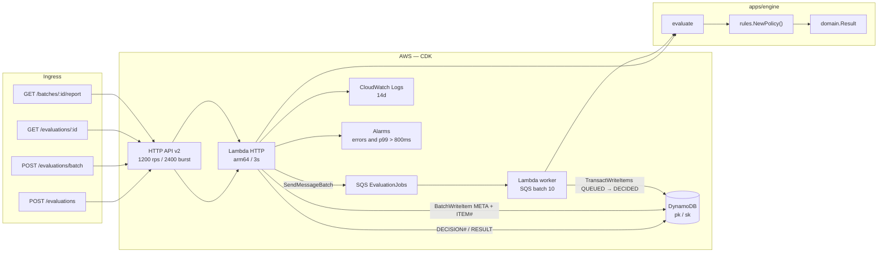
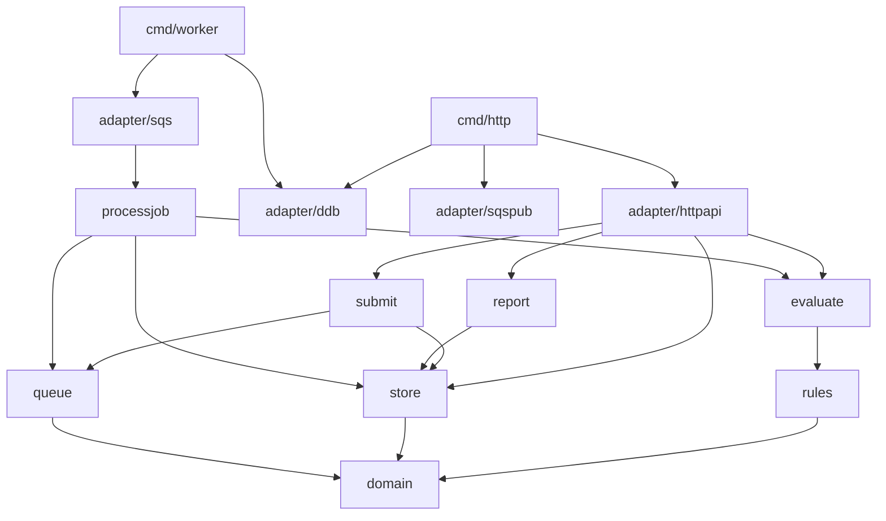
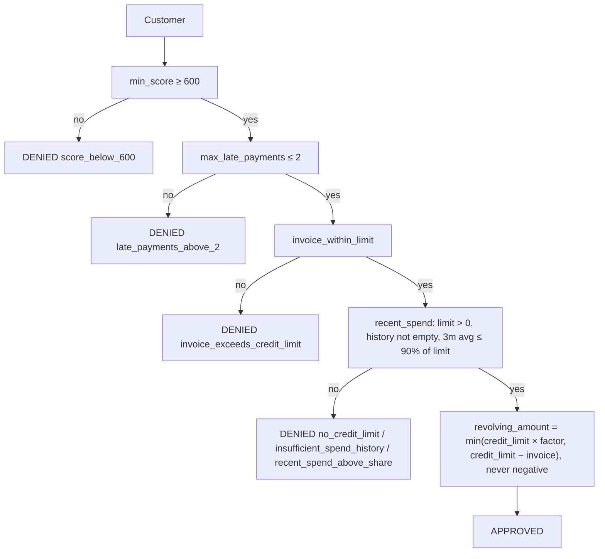

# Architecture

A revolving-credit evaluation simulation. There is no bureau, core banking
system, or frontend: the cut is the rules engine, the report, and the AWS
infra that backs the evaluation criteria.

IaC is **CDK in Go** (`packages/infra-iac/`). The product lives in
`apps/engine/`, split by use case. This file, `apps/engine/architecture_test.go`,
and the stack describe the cut.

## Cut

| Piece | Role |
|---|---|
| `internal/domain` | Customer profile, its validation, and the decision. No I/O. |
| `internal/rules` | Chain of Responsibility plus the `AmountPolicy` strategy. `NewPolicy()` is the policy factory. |
| `internal/evaluate` | Use case: one customer → `Result`. Applies the `rules.Policy`: the chain decides, the amount policy sizes an approval. Stores nothing; the caller records the decision. |
| `internal/submit` | Use case: at most `BATCH_SIZE` customers (default 100, max 1000) → a `batch_id`, every batch item stored `QUEUED`, then one SQS message per item. |
| `internal/processjob` | Use case: queue message → evaluate → `BatchStore.Decide`. A repeated delivery is a no-op. |
| `internal/report` | Use case: `batch_id` → `Report` (derived batch status, counters, approved, denied, failed, cancelled, total). |
| `internal/queue` / `internal/store` | Ports: `queue.Publisher`, `store.BatchStore` (`Create`, `Decide`, `Report`), `store.DecisionStore` (`Save`, `Get`). Memory in tests; SQS and DynamoDB in adapters. The store owns the item status transitions. |
| `internal/adapter/httpapi` | HTTP API v2. Validates customers before calling a use case. Stores a single evaluation through `DecisionStore`. |
| `internal/adapter/sqs` | Worker: consumes the queue. |
| `internal/adapter/sqspub` / `ddb` | `SendMessageBatch` publisher; both store ports on one DynamoDB table. |
| `cmd/http` `cmd/worker` | Composition root. |
| `packages/infra-iac` | CDK: HTTP API, two Lambdas, SQS, DynamoDB, logs, alarms. |
| `packages/loadtest` | k6 at `LOADTEST_RATE` req/s (default **100** locally) on `POST /evaluations/batch` for 10s. The 1000 req/s NFR run (10k jobs) is `LOADTEST_RATE=1000 make loadtest` against a real AWS stack. |

## Runtime



Two paths, on purpose:

- **Sync** (`POST /evaluations`): one customer, 1s SLO, decide now. The
  decision is stored under a new `decision_id` and read back with
  `GET /evaluations/{id}`.
- **Batch** (`POST /evaluations/batch` → SQS → worker →
  `GET /batches/{id}/report`): HTTP stores the batch items and enqueues. This
  is the loadtest path (1000 req/s NFR on real AWS, 100 req/s by default on Floci).

DynamoDB runs **after** the decision. If the table is down on the sync path,
the decision is already computed and the store returns `500` (the client
retries). On batch, HTTP already returned `202`; SQS retries the worker.

### Batch submission

`POST /evaluations/batch` accepts at most **`BATCH_SIZE`** customers (default
100, max 1000). A larger batch returns
`422 {"error":"batch_too_large","max":<BATCH_SIZE>}` and nothing is stored or
queued. The CDK stack passes `BATCH_SIZE` from the synth environment to the
HTTP Lambda and fails the synth on a value outside 1..1000; the Lambda fails
at startup on one as well. `scripts/floci.env` defaults it to 100 so local runs
stay light; raise it with `BATCH_SIZE=1000 make local-deploy`. Otherwise `submit`:

1. creates a `batch_id`;
2. stores `META` (`queued=N`, `decided=0`, `failed=0`, `cancelled=0`) and one
   `ITEM#<index>` per customer (`status=QUEUED`, `attempts=1`, the customer
   input) with `BatchWriteItem`, 25 items per call, 8 calls in flight, and
   `UnprocessedItems` retried with backoff;
3. publishes one message per item, `{batch_id, index, attempt, customer}`,
   with `SendMessageBatch`, 10 messages per call, 10 calls in flight. The
   publisher returns the indexes that failed;
4. returns `202 {"batch_id","queued"}`. If any message failed to publish, it
   returns `500 {"error":"enqueue_failed"}`.

Items are stored before any message is published, so a message never names an
item that does not exist. No step makes one call per customer.

### Batch item status

The worker evaluates the message and calls
`BatchStore.Decide(batch_id, index, attempt, result)`. One DynamoDB transaction
(`TransactWriteItems`) moves the item from `QUEUED` to `DECIDED`, stores the
result, and updates `META` (`queued−1`, `decided+1`), only if the item is
`QUEUED` on the same attempt. A repeated delivery fails that condition, gets
`ErrInvalidTransition`, and the worker treats it as success: the item is
decided once and the total is not inflated.

The batch status is derived from the `META` counters on every read, never
stored:

| Batch status | When |
|---|---|
| `PROCESSING` | `queued > 0` |
| `NEEDS_ATTENTION` | `queued = 0` and `failed > 0` |
| `COMPLETED` | otherwise (every item decided or cancelled) |

`GET /batches/{id}/report` reads the whole batch with one paginated `Query` on
`pk = BATCH#<batch_id>`, following `LastEvaluatedKey` past 1 MB pages. It
never reads one item at a time.

## Data model

One DynamoDB table, `Decisions`, with generic keys `pk` (string) and `sk`
(string).

| `pk` | `sk` | Attributes |
|---|---|---|
| `DECISION#<decision_id>` | `RESULT` | `customer` (input JSON), `result` (decision JSON) |
| `BATCH#<batch_id>` | `META` | `queued`, `decided`, `failed`, `cancelled` |
| `BATCH#<batch_id>` | `ITEM#<index>` | `index`, `customer` (input JSON), `status`, `attempts`, `result` once decided |

The input and the item status live in one item, so there is no separate input
row. Stored decisions and batch items, including the full CPF and name, are
kept with no expiry (no TTL): they are the audit record. Every API response
masks the CPF (`***` + last 2 digits).

## Packages

The same DAG that `architecture_test.go` locks. `domain` does not import AWS.
A new rule is a `Handler` plus one `SetNext` in the factory. A new amount
calculation is an `AmountPolicy` set in the same factory. Use cases and
adapters do not change.



## Validation

The HTTP adapter validates every customer with `domain.Customer.Validate()`
before it calls a use case. Validation does no I/O and returns every
violation as `{field, code}`. An invalid customer is never evaluated and gets
no decision.

| Field | Code | When |
|---|---|---|
| `cpf` | `invalid_length` | not 11 digits after removing dots and dash |
| `cpf` | `repeated_digits` | all 11 digits are the same (`11111111111`) |
| `cpf` | `invalid_check_digits` | either mod 11 check digit is wrong |
| `name` | `required` | empty or blank |
| `credit_score`, `current_invoice_cents`, `credit_limit_cents`, `late_payments` | `negative` | below zero |
| `monthly_spend_cents[i]` | `negative` | entry `i` is below zero |

The CPF is normalized to 11 bare digits (`390.533.447-05` → `39053344705`)
before it reaches a use case.

- `POST /evaluations`: malformed JSON → `400 {"error":"invalid_json"}`. An
  invalid customer → `422 {"error":"invalid_customer","violations":[...]}`.
- `POST /evaluations/batch`: if any customer is invalid, the whole batch is
  rejected with `422`, each violation carries the customer's `index`, and
  nothing is stored or published.

```json
{"error":"invalid_customer","violations":[{"index":1,"field":"cpf","code":"invalid_check_digits"}]}
```

## Decision

The policy is a `rules.Policy` built by `rules.NewPolicy()`: the rule chain
plus the amount policy. Chain of Responsibility: the first rule that denies
stops the chain, with one reason. The amount is computed only if every rule
passes.



Amount policy (`rules.AmountPolicy`, implemented by `rules.ScoreBands`): a
higher score gets a larger share of the credit limit on revolving credit,
capped at `credit_limit − current_invoice` and never negative:

| Score | Factor |
|---|---|
| ≥ 800 | 80% |
| 700–799 | 50% |
| 600–699 | 30% |
| < 600 | never reaches here — `min_score` denies |

Money is integer cents. Reports and logs use a masked CPF (`***` + last 2
digits), never the raw CPF.

## Why these rules

Criteria are documented here. This is not a real bureau.

1. **Minimum score 600** — below that, revolving credit is already materialized
   credit risk. One cut, testable, no model.
2. **At most 2 late payments** — recent delinquency is the cheapest predictor
   of revolving default. Three or more means collections already started.
3. **Invoice ≤ credit limit** — granting revolving on top of an over-limit
   invoice increases exposure with no collateral.
4. **Recent spend ≤ 90% of limit** — a customer already consuming the limit
   is revolving in practice. Average of the last 3 months, not a single month.
   A credit limit of zero or less denies with `no_credit_limit`. An empty spend
   history denies with `insufficient_spend_history`: there is no evidence to
   size the risk.

Change a cutoff = a field on the rule struct or a band. Change the policy = a
new file plus one `SetNext` (or a new `AmountPolicy`) in `rules.NewPolicy()`.

## Evaluation criteria → design

| Criterion | How the design answers |
|---|---|
| **Latency ≤ 1s** | Sync engine, no I/O on the hot path. Lambda timeout 3s, 256 MB, arm64, **no VPC**. p99 alarmed at 800 ms. |
| **Accuracy** | Customers validated at the edge (CPF check digits, no negatives). Deterministic rules. Table tests in `domain`, `rules`, and `evaluate`. Stable reason code per rule. |
| **Scale 10k/min** | NFR floor. The cut demonstrates **1000 req/s** on batch: HTTP enqueues (202), worker processes batch 10, Dynamo on-demand. Stage at 1200 rps / 2400 burst. k6: `LOADTEST_RATE=1000 make loadtest` against real AWS, 1000/s × 10s = 10k jobs (local default 100 req/s). |
| **Extensibility** | `rules.Handler` + `rules.AmountPolicy`, assembled in `rules.NewPolicy()`. `architecture_test.go` keeps domain off AWS. |
| **LGPD** | CPF masked on `Result`. Encryption at rest managed. IAM only on the decisions table. No API auth in this cut (fictional data); production would be IAM on the HTTP API. |
| **Observability** | 14-day logs. Error and duration alarms. Dashboard for volume and p99. Reason codes in response JSON = deny rate per rule. |
| **Resilience** | The decision is pure. Persistence is after. On batch, SQS isolates HTTP from the worker: 202 already left; visibility + retry if Put fails. On-demand table. 5xx alarm on the sync path. |

## API

Wire types: `events.APIGatewayV2HTTPRequest` / `HTTPResponse`.

| Method | Path | Body | Response |
|---|---|---|---|
| `GET` | `/health` | — | `{"status":"ok"}` |
| `POST` | `/evaluations` | one `Customer` | `200` + `{decision_id, ...Result}` (sync, 1s SLO); `400` malformed JSON; `422` invalid customer |
| `GET` | `/evaluations/{id}` | — | `200` + the same `{decision_id, ...Result}`; `404 {"error":"not_found"}` |
| `POST` | `/evaluations/batch` | `{customers:[...]}` or array, at most `BATCH_SIZE` (default 100, max 1000) | `202` + `{batch_id, queued}`; `422` with indexed violations or `batch_too_large`, nothing stored or published |
| `GET` | `/batches/{id}/report` | — | `200` + report; `404 {"error":"not_found"}` |

The report:

```json
{
  "batch_id": "…",
  "status": "COMPLETED",
  "counters": {"queued": 0, "decided": 2, "failed": 0, "cancelled": 0},
  "approved": [{"index": 0, "name": "Ana Souza", "cpf_masked": "***05", "decision": "APPROVED",
                "reasons": ["eligible"], "revolving_amount_cents": 400000, "attempts": 1}],
  "denied": [{"index": 1, "name": "Bruno Lima", "cpf_masked": "***09", "decision": "DENIED",
              "reasons": ["score_below_600"], "revolving_amount_cents": 0, "attempts": 1}],
  "failed": [],
  "cancelled": [],
  "total_revolving_amount_cents": 400000
}
```

`total_revolving_amount_cents` sums approved items only.

## Infra (CDK Go)

`packages/infra-iac/` is the CDK app. `cdk.json` points at
`go run ./packages/infra-iac`. One stack, `us-east-1`.

| Resource | Choice | Why |
|---|---|---|
| HTTP API v2 | instead of REST API | less overhead; Floci covers it; no WAF/usage plan in this cut |
| Lambda `provided.al2023` arm64 | `GoFunction` | Go binary, cold start low enough for the SLO |
| Timeout 3s / 256 MB | — | SLO is 1s; 3s is a safety cap, not the budget |
| DynamoDB on-demand | instead of RDS | keys `pk` / `sk` (see Data model); batched writes on submit, one transaction per decided item; no connection |
| AWS managed encryption | instead of CMK | a CMK does not change the case and costs more in the demo |
| No VPC | — | an ENI on cold start blows the 1s SLO for no reason; the table does not need a private network |
| No Cognito / authorizer | — | this cut is a simulation with fictional data |
| No SAM | — | one IaC, in the same language as the engine |
| Worker + SQS | 1000 req/s batch | HTTP stores the items with `BatchWriteItem` and publishes with `SendMessageBatch`; the worker evaluates and decides the item |
| Routes | `POST /evaluations`, `GET /evaluations/{id}`, `POST /evaluations/batch`, `GET /batches/{id}/report`, `GET /health` | one HTTP Lambda serves every route; both Lambdas read and write the table, the HTTP Lambda sends to the queue |

```bash
make test
make local-bootstrap && make local-deploy
```

Evaluator: open the repo in the Dev Container (`.devcontainer/`). Steps and
curls: [`README.md`](../README.md).

## Rejected

| Alternative | Why not |
|---|---|
| SAM + CDK | Two IaC tools for the same stack. |
| RDS / Postgres | Latency and a connection pool for one Put per request. |
| `httpadapter` + `net/http` | Hides the HTTP API contract. The wire types are the AWS events. |
| Event sourcing / SNS / projectors | Closes none of the NFRs above. |
| Cognito + WAF + custom domain | Production theater. The cut is the engine and the rationale. |
